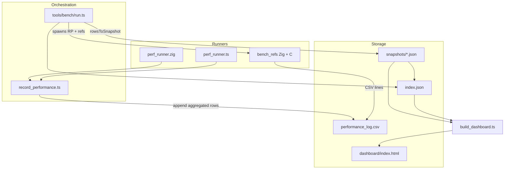
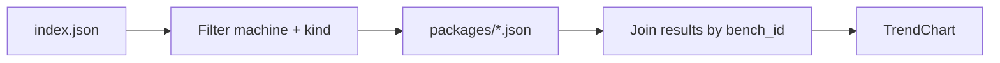

# MathZig Progress Dashboard: Perf Tracking + Feature Matrix

| Field | Value |
|-------|-------|
| **Title** | MathZig Progress Dashboard App: Perf Tracking + Feature Matrix (versioned history) |
| **Author** | TBD |
| **Date** | 2026-07-09 |
| **Status** | Draft (revised after design review) |
| **Extends** | [Plan 08 — Perf Benchmark Dashboard](docs/plans/08_perf_benchmark_dashboard.md) (Phase 1 complete) |
| **Related** | `Agents.md` feature protocol; `tools/testing/feature_gate.ts`; `tools/bench/*` |

---

## Overview

MathZig already has a solid Phase-1 performance pipeline: multi-sample capture via Zig/TS runners, aggregation into `performance_log.csv`, structured snapshots under `tests/artifacts/performance/snapshots/`, a registry index, pairwise regression compare, and a generated Chart.js HTML dashboard. Correctness gates (`feature_gate.ts`) enforce **test first, then perf**, and Zig VM remains the source-of-truth baseline.

What is missing is a **first-class progress product**: a versioned package that bundles correctness + feature coverage + performance per merge; a machine-readable, versioned **feature × backend** matrix; and a proper app under `apps/` (sibling to `apps/console`, not folded into it) that visualizes trends, regressions, and feature landing history over time.

This design extends Plan 08 rather than replacing it. It keeps `tools/bench` and `tools/testing` as the capture/compare layer, introduces a **version package** artifact model under `tests/artifacts/progress/`, adds a **feature catalog + matrix builder**, and ships **`apps/progress`** (Vite + SolidJS + Tailwind) as a static-hostable UI that consumes generated JSON.

**Safe defaults (post-review):** day-to-day feature gate keeps **zig-only** perf by default (`FEATURE_GATE_BENCH_MODE=zig`). Multi-backend + refs is **opt-in** for pre-merge/release. Smoke/standard/full tiers are currently **metadata + ref-append labels only**—not a bench subset filter—until a dedicated tier-filter PR lands. Feature matrix derivation may only use parity CSVs for backends **executed in this package build**.

---

## Background & Motivation

### Current state (grounded in repo)

| Layer | Path | Role today |
|-------|------|------------|
| Manifest | `bench/manifest.json` | Bench IDs, tiers (`smoke`/`standard`/`full`), aliases, `backend_from_test_name` prefixes |
| Zig/TS runners | `tests/performance/perf_runner.zig`, `perf_runner.ts` | Emit raw CSV rows |
| Orchestrator | `tests/performance/record_performance.ts` | Multi-sample runs → aggregate stats → append CSV |
| Bench CLI | `tools/bench/run.ts` | Capture (record_performance) → ref benches → snapshot → index |
| Snapshot model | `tools/bench/types.ts`, `snapshot.ts` | Structured JSON per `feature_id` + SHA |
| Index | `tools/bench/build_index.ts` | Registry of snapshots → `index.json` |
| Static dashboard | `tools/bench/build_dashboard.ts` | Embeds data into Chart.js HTML |
| Compare | `tools/testing/compare_perf.ts` | Pairwise regression markdown (thresholds, hot/integration, CV) |
| Feature gate | `tools/testing/feature_gate.ts` | Correctness → `perf_zig_record` → compare; skips perf on fail |
| Thread matrix | `tools/testing/feature_gate_matrix.ts` | Re-runs gate at thread counts 1/2/4/8 — **not language features** |
| Overview | `tools/testing/testing_overview.ts` | Latest parity coverage + perf summary JSON/MD |
| Artifacts | `tests/artifacts/performance/*`, `runs/*`, `parity/*` | Local; **gitignored** via `/tests/artifacts/**` |
| Ref benches | `bench/refs/` mandelbrot, binarytree (Zig + C) | External baselines |
| AOT vs JS | `tools/bench/aot_vs_js.ts` | Head-to-head decision tool; **not** in tracked pipeline |
| Console app | `apps/console/` | Vite + SolidJS + Tailwind — REPL/UI only |

**Approx. data volume today:** ~53 parity case files; ~16 perf snapshots; ~307 CSV rows in `performance_log.csv`.

### Pain points

1. **Dashboard is generated HTML**, not an app — hard to iterate on UX, no client routing, no feature matrix.
2. **Feature status is fragmented**: manual `docs/reference/wasm_parity_matrix.md`, mathjs catalog in `docs/comparisons/matjs_feature_list.md`, parity `skip` lists, and `testing_overview` coverage counts — no versioned machine-readable store.
3. **Multi-backend story is incomplete in one place**: perf backends (`mathzig_zig`, `mathzig_ffi`, `native_js`, `ref_zig`, `ref_c`) vs correctness backends (`zig_vm`, `ts_ffi`, `ts_wasm_vm`, `wasm_aot`, plus `wasm_aot_legacy` / opt-in `wasm_aot_standalone`) use different names; WASM AOT not in bench manifest (Plan 08 Phase 4 / DSL refs + WASM binding tier).
4. **Post-merge “version package” does not exist**: gate writes `tests/artifacts/runs/<feature_id>/summary.md` and appends CSV; bench writes a snapshot — but there is no single folder that joins correctness + features + perf for timeline browsing.
5. **Artifacts are gitignored**: selected release history cannot be shared unless we deliberately carve out committed paths.
6. **Feature gate records only Zig perf** (`record_performance.ts … zig`), not full multi-backend + refs, and does not call `tools/bench/run.ts` yet (Plan 08 Phase 2 still open). **This design deliberately keeps zig-only as the default** until multi-backend is opt-in via env (see Key Decision 9).

### Why now

Phase 1 of Plan 08 is complete and usable. The next increment should productize progress tracking so each merge leaves a durable, comparable package and a UI that answers: *What works where? How fast is it vs Zig and vs JS? Did we regress? When did feature X land on backend Y?*

---

## Goals & Non-Goals

### Goals

1. **Document and preserve** the existing perf capture/compare path; extend it, do not replace Phase 1.
2. Introduce a **version package** (one directory per version/run) with correctness, features, and optional performance.
3. Design a **versioned feature matrix** (features × backends × status) with history.
4. Ship **`apps/progress`**: Solid/Vite/Tailwind app for perf overview, trends, regression board, feature matrix, version browser.
5. Integrate into **feature_gate → package → (optional) bench → app data** with mandatory correctness-first order and **safe cost defaults**.
6. Keep UI **static-hostable** (build-time data copy into `public/data`); no backend server in v1.
7. Provide an incremental **PR plan** that is independently mergeable and orders gate safety before multi-backend defaults.

### Non-Goals

- Not a production monitoring SaaS / multi-tenant cloud.
- Not replacing or embedding into `apps/console`.
- Not a CI cloud farm in v1 (local `machine_id` isolation remains; silent cross-machine compare is forbidden).
- Not inventing large new micro-benchmark suites unless needed for matrix completeness.
- Not rewriting runners into a single binary in this design’s v1 (that remains Plan 08 Phase 2; optional later PR).
- Not full mathjs gap analysis UI in v1 (deferred; see Key Decisions).
- Not automatic commit of every local dev package into git (only release/selected packages — see Key Decisions).
- Not claiming that `smoke`/`standard`/`full` filter which benches execute until a dedicated tier-filter PR exists.
- Not including `mathjs_examples` in matrix derivation unless a catalog entry explicitly maps them.

---

## A. Analysis: How Perf Tracking Works Today

### A.1 Capture path (end-to-end)



**Step detail:**

1. **`record_performance.ts <feature_id> [all|zig|ts]`**
   - Runs Zig and/or TS perf runners with `PERF_SAMPLES` (default 5) + warmup.
   - Aggregates per `test_name`: p50/p95/stddev ops, duration stats, env metadata (`git_sha`, `cpu_model`, `os`, zig/bun versions).
   - Appends rows to `tests/artifacts/performance/performance_log.csv`.
   - **No tier argument and no manifest-driven bench filtering.** Runners emit their full suite for the selected mode.

2. **`tools/bench/run.ts --feature X --tier smoke|standard|full [--tag vX] [--mode all|zig|ts]`**
   - Unless `--skip-perf` / `--refs-only`: invokes `record_performance.ts` with the chosen **mode** (default `all`).
   - **Tier semantics today (important):**
     - Writes `tier` into the snapshot metadata.
     - If tier is `smoke`, `standard`, **or** `full`, runs reference binaries (`bench_refs`, C mandelbrot/binarytree) and appends their CSV lines — **all three tiers run refs**.
     - **Does not** consult `bench/manifest.json` `tiers.smoke|standard|full` lists to select which benches execute.
     - Therefore **“smoke for speed” is not true in current code**. Plan 08 text and manifest tier lists describe intent; capture path has not implemented filtering yet.
   - Filters CSV by `feature_id`, calls `rowsToSnapshot()` → writes `snapshots/<id>.json`, rebuilds index.

3. **`rowsToSnapshot` (`tools/bench/snapshot.ts`)**
   - Resolves `bench_id` via manifest aliases, `backend` via prefix rules, `threads` via `_t(\d+)$`.
   - Score prefers `ops_p50` over `ops_per_sec`.
   - Snapshot id = `git_tag` if present, else `{feature_id}_{git_sha}`.
   - Kind = `release` if tag else `dev`.
   - `machine_id` = slug of `osInfo-cpuModel` (e.g. `darwin-arm64-apple-m1-pro`).

4. **Legacy import**: `tools/bench/import_csv.ts` backfills snapshots from historical CSV rows.

### A.2 Backend identity and baselines

**Perf backends** (from `bench/manifest.json` → `backend_from_test_name`):

| Prefix | Backend id | Meaning |
|--------|------------|---------|
| `zig_` | `mathzig_zig` | Native Zig VM |
| `ffi_` | `mathzig_ffi` | TS via FFI |
| `native_js_` | `native_js` | Pure JS baseline (arithmetic) |
| `ref_zig_` | `ref_zig` | Plain Zig reference (not DSL) |
| `ref_c_` | `ref_c` | Plain C reference |

**Correctness / parity backends** (`tests/parity/cli.ts`):

| Backend | In DEFAULT_BACKENDS? | Role |
|---------|----------------------|------|
| `zig_vm` | Yes | Source of truth (Agents.md) |
| `ts_ffi` | Yes | FFI binding path |
| `ts_wasm_vm` | Yes | WASM interpreter path |
| `wasm_aot` | Yes | AOT-compiled WASM |
| `wasm_aot_legacy` | Yes | Legacy AOT path |
| `wasm_aot_standalone` | No (opt-in via `--standalone` or backends filter) | Standalone AOT; **inherits `wasm_aot` skips** in CLI |

Extra modules exist under `tests/parity/backends/` (`native.ts`, `wasm_vm.ts`, `ffi.ts`) but are not in DEFAULT_BACKENDS.

**v1 matrix columns (product decision):** `{zig_vm, ts_ffi, ts_wasm_vm, wasm_aot}` only.

| Backend | Matrix v1 |
|---------|-----------|
| `zig_vm`, `ts_ffi`, `ts_wasm_vm`, `wasm_aot` | **Columns** |
| `wasm_aot_legacy` | **Out of scope** (ignored for matrix; may still appear in raw parity CSVs) |
| `wasm_aot_standalone` | **Out of scope** for columns; skip rule: if a case skips `wasm_aot`, standalone is also skipped (CLI behavior) — document only |
| `native_js`, `ref_zig`, `ref_c` | **Perf-only**, not matrix columns |

**Naming gap:** perf uses `mathzig_zig` / `mathzig_ffi`; parity uses `zig_vm` / `ts_ffi`. The progress system must maintain an explicit **backend alias map** so the UI can join feature matrix columns with perf series without conflating them.

**Alias map (real joins only):**

| Parity id | Perf id | Notes |
|-----------|---------|-------|
| `zig_vm` | `mathzig_zig` | Narrative join only; keep separate ids in data |
| `ts_ffi` | `mathzig_ffi` | Same |
| `ts_wasm_vm` | — | No perf backend until future work |
| `wasm_aot` | — | No perf backend until PR11 (Plan 08 WASM binding tier) |

Do **not** invent joins for wasm↔perf until PR11 ships a real perf backend id.

**Baselines for ratios:**

| Baseline | Used for | When shown |
|----------|----------|------------|
| Zig VM (`mathzig_zig` / correctness `zig_vm`) | Correctness SoT; primary perf “engine” baseline | Ratio column when both numerator and `mathzig_zig` exist for same `bench_id`+`threads` |
| `native_js` | Arithmetic speed vs hand-written JS | **Optional column** only when both present; many benches are zig-only → empty cell, not error |
| `ref_zig` / `ref_c` | Algorithm-level ceiling (mandelbrot, binarytree; future vecdot/gemm) | **Only for benches that include ref backends in the snapshot**; do not promise universal ref ratios |
| AOT vs JS (`aot_vs_js.ts`) | Decision tool only today — not in snapshot pipeline | Deferred until PR11 |

### A.3 Compare path and thresholds

`tools/testing/compare_perf.ts <baseline_feature_id> <after_feature_id> [max_regression_pct] [suite]`:

- Reads entire CSV; aggregates by `test_name` within each feature id.
- Suite filter: `zig` → `zig_*`; `ts` → `ffi_*`/`native_*`/`ts_*`; `all` → everything.
- Classification thresholds (env-overridable defaults):
  - Hot path: **3%** (`PERF_THRESH_HOT`)
  - Integration: **8%** (`PERF_THRESH_INTEGRATION`)
  - Default CLI max regression: **5%**
  - Unstable if CV > **0.10** (`PERF_UNSTABLE_CV`)
  - Absolute regression if drop > **1000 ops** (`PERF_ABS_DROP_OPS`) and relative threshold hit
- Emits **markdown only**: `tests/artifacts/performance/{after}_vs_{baseline}.md`
- Statuses: `OK | REGRESSION_REL | REGRESSION_ABS | UNSTABLE | MISSING_AFTER | NEW_IN_AFTER`
- Does **not** resolve `bench_id` / `backend` / `threads` via `tools/bench/manifest.ts`.
- Does **not** use per-bench `manifest.regression_threshold_pct` (uses name heuristics: arithmetic/vecdot → 3%, timeseries/ode → 8%).
- Feature gate today passes suite **`zig`**.

Manifest also carries per-bench `regression_threshold_pct` (e.g. arith 3, complex 5, timeseries/ode 8) — used conceptually by Plan 08 dashboard; compare_perf still uses its own hot/integration heuristics by test name.

**Progress design requires a real structured compare SoT** (not a thin markdown parse of `compare_perf.ts`):

- New module: **`tools/progress/compare_performance.ts`** (preferred SoT for packages + gate + shared algorithm the app can import), **or** an extension of `compare_perf.ts` that emits JSON and resolves via manifest.
- Must resolve: `bench_id`, `backend`, `threads`, `threshold_pct` (prefer manifest when `bench_id` known; fall back to hot/integration heuristics).
- Must emit `performance_compare.json` rows (see B.3).
- Gate compare suite must match **executed** bench mode (`zig` when mode=zig; `all` when mode=all), not a hard-coded suite when mode changes.
- Baseline selection must require matching `machine_id`.

Client-side reimplementation in the app is **forbidden** as a second algorithm; the app imports the same module or consumes precomputed JSON.

### A.4 Machine isolation rules

- Every snapshot carries `machine_id`, `cpu_model`, `cpu_cores`, `os`.
- Index stores a single top-level `machine_id` (last snapshot’s machine) — **weak today**.
- Rule (Plan 08 + this design): **never silently compare across machines**. UI must:
  - Default filter = current machine_id of selected package / local machine.
  - If multiple machine_ids present, show a **warning banner** and require explicit multi-machine mode.
  - Regression board only pairs packages with matching `machine_id` unless user overrides.

### A.5 Feature gate ordering (correctness first)

From `tools/testing/feature_gate.ts` and `Agents.md`:

```
1. zig build vm-baseline
2. zig build test
3. bun test
4. parity --full (backends default zig_vm,ts_ffi; env FEATURE_GATE_PARITY_BACKENDS)
5. IF correctness OK:
     perf_zig_record (record_performance zig only)
     optional parity_compare + perf_compare vs baseline
   ELSE: skip all perf steps
6. testing_overview
```

Writes `tests/artifacts/runs/<feature_id>/summary.md` + step logs. Final status PASS/FAIL.

**Gaps vs progress product (addressed later with safe defaults):**

- No version package.
- No feature matrix snapshot.
- No structured compare JSON.
- Gate does not call `tools/bench/run.ts` (Plan 08 Phase 2 open).
- Multi-backend + refs is **not** made default by this design (Key Decision 9 rewritten).

### A.6 What’s missing for multi-backend trend visualization

| Gap | Impact |
|-----|--------|
| Static HTML only | No filters, deep links, version drill-down |
| Feature gate → zig-only perf | FFI / native_js / refs missing from **default** gate path (by design for cost); opt-in `mode=all` |
| Tier lists unused as filters | Cannot rely on `--tier smoke` for cheaper runs today |
| No wasm_aot in manifest | AOT **perf** trends not first-class until PR11 |
| Backend name split (perf vs parity) | Hard to join matrix + charts |
| No version package | Cannot browse “this merge’s full story” |
| No feature matrix store | Cannot answer “when did X land on wasm_aot?” |
| Stale parity CSVs on disk | Risk of false matrix cells if not gated by `backends_executed` |
| Artifacts gitignored | No shared history without new commit policy |
| Index mixes machines weakly | Risk of silent cross-machine plots |
| Dashboard series key `backend@tN` | Threads mixed into series; UI needs default thread filter |

---

## B. Versioned Run Package (Artifact Model)

### B.1 Layout

```
tests/artifacts/progress/
  index.json                          # registry of all packages (local + scanned releases)
  packages/
    <version_id>/
      meta.json                       # identity, git, machine, gate outcome
      correctness.json                # step results + parity summary per backend
      features.json                   # feature matrix snapshot for this version
      performance.json                # bench results (or skipped stub)
      performance_compare.json        # optional vs baseline (structured; from SoT module)
      summary.md                      # human-readable rollup
```

**Committed release history — preferred path (if gitignore allowlist works):**

```
tests/artifacts/progress/releases/    # ONLY release-kind packages, curated
  index.json
  packages/
    v0.1.0/
      ...
```

**Alternative path (if nested gitignore allowlist is painful):** commit under a path **outside** `/tests/artifacts/**`:

```
tests/progress_releases/              # NOT covered by /tests/artifacts/**
  index.json
  packages/
    v0.1.0/
      ...
```

PR9 must pick one after a `git check-ignore -v` dry-run (see E.5). Document the choice in the promote tool and app data builder (`RELEASES_DIR`).

Local/dev packages stay under `tests/artifacts/progress/packages/` and remain gitignored.

### B.2 Version id scheme

| Kind | `version_id` format | Example |
|------|---------------------|---------|
| `dev` | `{feature_id}__{short_sha}` | `0101_new_feature_t1__7b56744` |
| `release` | git tag (sanitized) | `v0.3.0` |
| `failed` | same as dev, with `meta.status=failed` | still stored for history |

Use `__` between feature and sha to avoid ambiguity with feature ids that already contain underscores (including thread-matrix ids like `0101_feat_t4`). Double-underscore is easier to split than the current snapshot id `{feature_id}_{sha}`.

> Note: existing bench snapshot ids remain `{feature_id}_{sha}` for backward compatibility; the version package references the bench snapshot by path/id rather than renaming historical files.

**Overwrite policy:** writing a package with an existing `version_id` **replaces** the directory in place (last write wins). Rationale: same feature_id + same short sha is the same logical commit run; re-runs should refresh artifacts, not fork. Writers log a warning when overwriting. If full sha differs but short sha collides (extremely rare), use `git_sha_full` in meta and optionally suffix version_id with 2 more hex chars — document as edge-case handling in `write_package.ts`.

### B.3 File schemas

#### `meta.json`

```json
{
  "schema_version": 1,
  "version_id": "0101_new_feature_t1__7b56744",
  "kind": "dev",
  "status": "pass",
  "feature_id": "0101_new_feature_t1",
  "git_sha": "7b56744",
  "git_sha_full": "7b56744abc...",
  "git_tag": null,
  "recorded_at": "2026-07-09T12:00:00.000Z",
  "gate_started_at": "2026-07-09T11:58:00.000Z",
  "machine_id": "darwin-arm64-apple-m1-pro",
  "cpu_model": "Apple M1 Pro",
  "cpu_cores": 10,
  "os": "darwin-arm64",
  "zig_version": "0.15.2",
  "bun_version": "1.3.9",
  "mathzig_version": "0.1.0",
  "baseline_feature_id": "0100_prev_feature_t1",
  "baseline_version_id": "0100_prev_feature_t1__adc25bd",
  "tier": "smoke",
  "bench_mode": "zig",
  "has_performance": true,
  "bench_snapshot_id": "0101_new_feature_t1_7b56744",
  "gate_run_dir": "tests/artifacts/runs/0101_new_feature_t1",
  "parity_backends_executed": ["zig_vm", "ts_ffi"]
}
```

**Field sources:**

| Field | Source |
|-------|--------|
| `mathzig_version` | Read **`src/VERSION`** (SoT; currently `0.1.0`). Same content as `src/version.zig` embeds — do not hardcode. |
| `zig_version` / `bun_version` | Same approach as existing perf/env capture |
| `gate_started_at` | Timestamp at gate start (from `steps.json` or package writer clock if only packaging) |
| `parity_backends_executed` | Exact list of backends invoked in this gate/package build (mirrors `correctness.parity.backends_executed`) |
| `baseline_feature_id` | Gate CLI baseline argument (feature id space) |
| `baseline_version_id` | Resolved package id after baseline resolution (B.7) |
| `bench_mode` | `zig` \| `ts` \| `all` actually used for perf capture |

`status`: `pass | fail | partial`  
- `pass`: correctness green; perf present if requested and succeeded  
- `fail`: correctness failed; **no performance.json content required** (`has_performance: false`)  
- `partial`: correctness green but perf capture failed/incomplete, **or** compare skipped due to missing baseline  

#### `correctness.json`

```json
{
  "schema_version": 1,
  "overall": "pass",
  "gate_started_at": "2026-07-09T11:58:00.000Z",
  "steps": [
    { "id": "zig_vm_baseline", "status": "pass", "duration_sec": 12, "log": "..." },
    { "id": "zig_tests", "status": "pass", "duration_sec": 40, "log": "..." },
    { "id": "ts_tests", "status": "pass", "duration_sec": 8, "log": "..." },
    { "id": "parity_full", "status": "pass", "duration_sec": 90, "log": "..." }
  ],
  "parity": {
    "task_id": "0101_new_feature_t1",
    "backends_executed": ["zig_vm", "ts_ffi"],
    "backends": {
      "zig_vm": { "pass": 1200, "fail": 0, "skip": 0, "total": 1200, "csv": "tests/artifacts/parity/0101_new_feature_t1_zig_vm.csv" },
      "ts_ffi": { "pass": 1180, "fail": 0, "skip": 20, "total": 1200, "csv": "tests/artifacts/parity/0101_new_feature_t1_ts_ffi.csv" }
    },
    "backends_not_executed": ["ts_wasm_vm", "wasm_aot"],
    "report": "tests/artifacts/parity/0101_new_feature_t1_report.md"
  }
}
```

**Hard rule:** `parity.backends` may only include backends in `backends_executed`. Do **not** summarize leftover CSVs for backends not run in this package build. Aggregation uses the same semantics as `testing_overview.ts` `summarizeParityCsv`, but with a **real CSV parser** (or the parity writer’s row format), not naive comma-split (exprs contain quotes/commas). Prefer `steps.json` from the gate as the steps source — **never** scrape `summary.md` for structured fields once PR1a lands.

#### `features.json`

See §C — full matrix snapshot for this version. Must also record `backends_executed` and never mark non-executed backends `done` from stale CSVs.

#### `performance.json`

Either:

1. **Embed** results compatible with existing `Snapshot` type (`tools/bench/types.ts`), or  
2. **Reference** existing snapshot: `{ "ref": "tests/artifacts/performance/snapshots/….json", "snapshot": {…}, "results": […] }`

Recommendation: **embed a copy** of the snapshot payload so a version package is self-contained for archival/commit under `releases/`. Also set `meta.bench_snapshot_id` for linkage.

If correctness failed, omit file or write:

```json
{ "schema_version": 1, "status": "skipped", "reason": "correctness_failed", "results": [] }
```

If correctness passed but perf failed:

```json
{ "schema_version": 1, "status": "error", "reason": "bench_failed", "exit_code": 1, "results": [] }
```

#### `performance_compare.json` (optional)

Produced **only** by `tools/progress/compare_performance.ts` (or extended compare_perf that is the shared SoT). Not a parse of markdown.

```json
{
  "schema_version": 1,
  "baseline_version_id": "...",
  "after_version_id": "...",
  "baseline_feature_id": "...",
  "after_feature_id": "...",
  "machine_id": "darwin-arm64-apple-m1-pro",
  "suite": "zig",
  "source_module": "tools/progress/compare_performance.ts",
  "rows": [
    {
      "test_name": "zig_arithmetic_scalar",
      "bench_id": "arith.scalar",
      "backend": "mathzig_zig",
      "threads": 1,
      "baseline_score": 5.0e8,
      "after_score": 5.4e8,
      "pct_delta": 8.0,
      "threshold_pct": 3,
      "threshold_source": "manifest",
      "status": "OK"
    }
  ]
}
```

`threshold_source`: `manifest` | `heuristic_hot` | `heuristic_integration` | `cli_max`.

### B.4 Progress index

```json
{
  "schema_version": 1,
  "generated_at": "...",
  "packages": [
    {
      "version_id": "...",
      "kind": "dev",
      "status": "pass",
      "feature_id": "...",
      "git_sha": "...",
      "git_tag": null,
      "recorded_at": "...",
      "machine_id": "...",
      "has_performance": true,
      "tier": "smoke",
      "bench_mode": "zig",
      "path": "packages/0101_new_feature_t1__7b56744",
      "source": "local"
    }
  ]
}
```

Separate releases index for committed subset; app merges both at data-build time with `source: local|release`.

### B.5 Correctness-first packaging rules

| Gate outcome | Package written? | correctness | features | performance |
|--------------|------------------|-------------|----------|-------------|
| Fail mid-correctness | Yes (`status=fail`) | Yes (partial steps) | Yes (catalog + **executed** evidence only) | Skipped |
| Correctness pass, perf fail | Yes (`status=partial`) | Yes | Yes | Error stub + reason |
| All pass | Yes (`status=pass`) | Yes | Yes | Full snapshot + optional compare |

**Never** attach a “passing” performance story to a failed correctness package.

**Gate exit code policy (perf):**

| Condition | Package status | Gate exit (default) | Gate exit if `PERF_STRICT=1` |
|-----------|----------------|---------------------|------------------------------|
| Correctness fail | `fail` | non-zero (existing) | non-zero |
| Correctness pass, perf/infra fail | `partial` | **0 (soft)** | non-zero |
| Correctness pass, compare reports REGRESSION_* | `pass` + compare rows | **0 (soft)** unless `PERF_STRICT=1` | non-zero |
| All green | `pass` | 0 | 0 |

Rationale: day-to-day feature development must not be blocked by ref binary build flakes or perf noise; pre-merge/release can set `PERF_STRICT=1`.

### B.6 Writers

New module: `tools/progress/` (prefer small sibling to `tools/bench`, not a second parallel infra stack):

| File | Responsibility |
|------|----------------|
| `paths.ts` | `PROGRESS_DIR`, `RELEASES_DIR`, etc. |
| `types.ts` | Version package TypeScript types |
| `write_package.ts` | Assemble package from gate + parity + features + bench |
| `build_progress_index.ts` | Scan packages → index.json |
| `compare_performance.ts` | **SoT** structured compare (manifest thresholds + heuristics) |
| `build_features.ts` | Catalog load + derivation → `features.json` |
| `feature_status.ts` | Status decision table implementation |
| `promote_release.ts` | Copy local package → releases tree for a tag |
| `build_app_data.ts` | Flatten packages into `apps/progress/public/data/*` |

Wire from `feature_gate.ts` (and optionally a top-level `bun run progress:record`).

**PR1 requirement:** package writer consumes **`steps.json` only** for step results (PR1a must land first or in the same PR). Markdown scrape of `summary.md` is **not** an accepted primary path.

### B.7 Baseline package resolution

Gate CLI continues to accept **baseline as feature_id** (existing behavior + auto-detect latest PASS run dir). Packages need `baseline_version_id`.

**Resolution algorithm for `--baseline <feature_id|version_id>`:**

```
if arg matches existing package version_id:
  return that package
if arg looks like feature_id (or known feature_id):
  candidates = packages where
    feature_id == arg
    AND machine_id == current package machine_id
    AND status in {pass, partial}   # prefer pass
    AND (for perf compare) has_performance == true
  sort candidates by recorded_at desc
  return latest
else:
  fail with clear error
```

**Regression board default (UI):** previous package on the same `machine_id` with optional kind filter (`dev`/`release`), ordered by `recorded_at` — **not** “whatever rows share feature_id in the raw CSV” (CSV mixes historical noise).

**Thread matrix:** `feature_gate_matrix.ts` creates `taskBase_t{n}` feature ids. Resolve baseline `_t4` → after `_t4` by exact feature_id match + machine_id, not by stripping `_tN`.

Include both `baseline_feature_id` and `baseline_version_id` in `meta.json`.

---

## C. Feature Matrix Design

### C.1 Problem

There is no machine-readable “feature X on backend Y as of version Z” store. Sources today:

| Source | What it tells us | Limitation |
|--------|------------------|------------|
| Parity cases + `skip` | Runnable vs skipped per backend | Case-level, not product-feature-level; no status beyond skip |
| Parity run CSVs | PASS/FAIL/SKIP at runtime | Ephemeral (gitignored); needs packaging; **stale files poison naive reads** |
| `wasm_parity_matrix.md` | Manual AOT narrative | Not automated, not versioned in JSON |
| `matjs_feature_list.md` | mathjs catalog | Not MathZig status |
| `feature_gate_matrix.ts` | Thread scaling | Wrong “matrix” sense |
| `testing_overview.ts` | Aggregate coverage counts | Latest only, no history |

### C.2 Hybrid catalog (recommended)

**Authoring source of truth:** `bench/features/catalog.json` — explicit product features.  
**Format decision (v1):** **JSON** (zero new root dependencies; easy TypeScript types and validation). YAML is deferred unless authoring pain forces a later switch (then pin a YAML dep explicitly).

**Runtime enrichment:** derived from parity cases + **this version’s executed** parity results only.

Rationale:

- Pure derivation from parity cases yields noisy, file-granular “features” (`core_add_01`) rather than product features (“scalar arithmetic”, “timeseries join”).
- Pure manual docs drift (as `wasm_parity_matrix.md` already does).
- Hybrid: humans name/category features; automation fills backend status from evidence.

**Location alternative considered:** `tools/progress/catalog.json` (correctness-centric) vs `bench/features/` (next to manifest). **Keep `bench/features/catalog.json`** so “what we claim / what we measure” lives under `bench/` with the manifest; derivation code lives in `tools/progress/`.

### C.3 Catalog schema

```json
{
  "schema_version": 1,
  "backends": [
    {
      "id": "zig_vm",
      "kind": "correctness",
      "matrix_column": true,
      "aliases": ["mathzig_zig"]
    },
    {
      "id": "ts_ffi",
      "kind": "correctness",
      "matrix_column": true,
      "aliases": ["mathzig_ffi"]
    },
    {
      "id": "ts_wasm_vm",
      "kind": "correctness",
      "matrix_column": true,
      "aliases": []
    },
    {
      "id": "wasm_aot",
      "kind": "correctness",
      "matrix_column": true,
      "aliases": []
    },
    {
      "id": "wasm_aot_legacy",
      "kind": "correctness",
      "matrix_column": false,
      "notes": "In DEFAULT_BACKENDS but out of matrix v1"
    },
    {
      "id": "wasm_aot_standalone",
      "kind": "correctness",
      "matrix_column": false,
      "inherits_skips_from": "wasm_aot",
      "notes": "Opt-in CLI backend; out of matrix v1"
    },
    {
      "id": "native_js",
      "kind": "perf_baseline_only",
      "matrix_column": false
    },
    {
      "id": "ref_zig",
      "kind": "perf_baseline_only",
      "matrix_column": false
    },
    {
      "id": "ref_c",
      "kind": "perf_baseline_only",
      "matrix_column": false
    }
  ],
  "categories": [
    { "id": "arithmetic", "label": "Arithmetic" },
    { "id": "matrix", "label": "Matrix" },
    { "id": "complex", "label": "Complex" },
    { "id": "timeseries", "label": "Time Series" },
    { "id": "units", "label": "Units" },
    { "id": "ode", "label": "ODE / Solvers" },
    { "id": "control_flow", "label": "Control Flow" },
    { "id": "bindings", "label": "Bindings / Host" },
    { "id": "aot", "label": "WASM AOT" },
    { "id": "reference", "label": "Reference algorithms" }
  ],
  "features": [
    {
      "id": "arith.scalar",
      "category": "arithmetic",
      "label": "Scalar arithmetic",
      "description": "Number-only fast path (+ - * / ^ …)",
      "parity_case_files": ["core_arithmetic.json"],
      "id_prefix": null,
      "id_regex": null,
      "parity_case_ids": [],
      "related_bench_ids": ["arith.scalar"],
      "manual": {
        "zig_vm": "done",
        "ts_ffi": "done"
      },
      "notes": ""
    },
    {
      "id": "timeseries.join",
      "category": "timeseries",
      "label": "Time-series join",
      "description": "",
      "parity_case_files": ["timeseries_join.json"],
      "related_bench_ids": [],
      "manual": {
        "ts_wasm_vm": "skipped",
        "wasm_aot": "partial"
      },
      "notes": "See wasm_parity_matrix Phase 4"
    }
  ]
}
```

**Matcher API (normative):**

| Field | Type | Meaning |
|-------|------|---------|
| `parity_case_files` | `string[]` | Filenames under `tests/parity/cases/` (not recursive globs with `#`). Required unless only `parity_case_ids`. |
| `parity_case_ids` | `string[]` | Explicit case ids (exact match). |
| `id_prefix` | `string \| null` | If set, keep cases whose `id` starts with prefix. |
| `id_regex` | `string \| null` | If set, keep cases whose `id` matches (JS RegExp). |
| `related_bench_ids` | `string[]` | Optional deep-link from matrix cell → perf benches (product feature ≠ always a bench). |

**Match rule:** case is included if:

```
(file in parity_case_files OR parity_case_files empty and ids-only mode)
AND (parity_case_ids empty OR id in parity_case_ids)
AND (id_prefix null OR id.startsWith(id_prefix))
AND (id_regex null OR new RegExp(id_regex).test(id))
```

**Out of scope for v1 derivation:** `tests/parity/mathjs_examples/` (or similar trees) unless a feature explicitly lists those files. Default catalog seed only maps `tests/parity/cases/*`.

**Invented DSL rejected:** do not use `"core_arithmetic.json#*"` string globs.

### C.4 Status enum

| Status | Meaning |
|--------|---------|
| `done` | Implemented and parity green (or sticky manual where allowed) |
| `partial` | Subset implemented: mix of pass + skip, **or** some fail with some pass under the decision table |
| `missing` | Not implemented; sticky manual or no cases and catalog default |
| `skipped` | Explicitly skipped on this backend (from case `skip` or sticky manual) |
| `broken` | Expected to work but currently failing in this version’s parity run |
| `n/a` | Not applicable (sticky manual) |
| `unknown` | No runtime evidence for an **executed** backend, or backend **not executed** this version |

### C.5 Derivation algorithm (normative)

Inputs per package build:

- Catalog feature F  
- Backend B (matrix column only)  
- `backends_executed: string[]`  
- Parity case definitions (for skip lists)  
- Parity CSV for B **iff** `B ∈ backends_executed` (and optionally mtime ≥ `gate_started_at` as a secondary sanity check)

**Hard rule — stale CSV prevention:**

```
if B ∉ backends_executed:
  if manual[B] in {n/a, missing, skipped}: status = manual[B]; evidence = "manual_sticky"
  else: status = unknown; evidence = "not_executed"
  NEVER read tests/artifacts/parity/{task_id}_{B}.csv
```

For each feature F and backend B with `B ∈ backends_executed`:

```
cases = match(F)  # matcher API above
manual = F.manual[B]  # optional

# --- sticky manuals always win ---
if manual in {n/a, missing, skipped}:
  status = manual
  evidence = "manual_sticky"
  # even if CSV shows PASS (code may have been fixed; catalog still claims out-of-scope/skip
  # until author updates manual). Log a warning if CSV shows pass/fail contradicting sticky.

# --- collect runtime evidence ---
else if cases empty:
  status = manual if manual in {done, partial} else unknown
  evidence = manual ? "manual_default" : "no_cases"

else if all cases list B in skip:
  status = skipped
  evidence = "case_skip_all"

else if CSV for B available (executed):
  parse CSV with proper CSV parser → per matched case id: pass|fail|skip
  apply DECISION TABLE (C.5.1)
  evidence = "parity_csv"

else:
  # executed claimed but file missing
  if manual in {done, partial}:
    status = unknown          # do NOT trust stale manual done without CSV
    evidence = "missing_csv"
  else if any skip-only from case defs:
    status = skipped
    evidence = "case_skip"
  else:
    status = unknown
    evidence = "no_csv"
```

**Priority summary:**

- Sticky: `n/a | missing | skipped` manuals  
- Runtime CSV overrides manual `done | partial` when evidence exists  
- Manual `done | partial` alone (no CSV) → **`unknown`**, not auto-`done` (prefer honesty over optimistic drift)  
- Non-executed backend → `unknown` (unless sticky manual)

#### C.5.1 Runtime decision table

Let `runnable = pass + fail` (excludes skip). Let `total_matched` include skips.

| Condition | Status |
|-----------|--------|
| `fail == 0` and `pass == runnable` and `runnable > 0` and `skip == 0` | `done` |
| `fail == 0` and `pass == runnable` and `runnable > 0` and `skip > 0` | `partial` |
| `fail > 0` and `pass == 0` | `broken` |
| `fail > 0` and `pass > 0` | `partial` if `fail / runnable ≤ 0.25`; else `broken` |
| `runnable == 0` and `skip > 0` | `skipped` |
| no matched rows in CSV (ids missing) | `unknown` |

Attach evidence object: `{ case_ids, pass, fail, skip, source, backends_executed }`.

**CSV parsing:** use a proper CSV parser (or shared parity row reader). Columns verified as `id,expr,status,reason`. Do not `line.split(",")`.

**Golden tests required (PR2):**

1. All cases skip on B → `skipped`  
2. Mix pass/fail under 25% fail → `partial`; above → `broken`  
3. No CSV + manual done → `unknown`  
4. Backend not in `backends_executed` → `unknown` (ignore planted stale CSV fixture)  
5. Manual `n/a` sticky despite CSV pass  
6. Manual `skipped` sticky despite CSV pass (warn)  

### C.6 Versioned matrix snapshot (`features.json`)

```json
{
  "schema_version": 1,
  "version_id": "0101_new_feature_t1__7b56744",
  "generated_at": "...",
  "catalog_hash": "sha256:…",
  "backends": ["zig_vm", "ts_ffi", "ts_wasm_vm", "wasm_aot"],
  "backends_executed": ["zig_vm", "ts_ffi"],
  "cells": [
    {
      "feature_id": "arith.scalar",
      "category": "arithmetic",
      "label": "Scalar arithmetic",
      "related_bench_ids": ["arith.scalar"],
      "by_backend": {
        "zig_vm": { "status": "done", "pass": 40, "fail": 0, "skip": 0, "evidence": "parity_csv" },
        "ts_ffi": { "status": "done", "pass": 40, "fail": 0, "skip": 0, "evidence": "parity_csv" },
        "ts_wasm_vm": { "status": "unknown", "evidence": "not_executed" },
        "wasm_aot": { "status": "unknown", "evidence": "not_executed" }
      }
    }
  ],
  "summary": {
    "zig_vm": { "done": 50, "partial": 2, "broken": 0, "skipped": 0, "missing": 1, "n/a": 0, "unknown": 3 },
    "ts_ffi": { "done": 48, "partial": 3, "broken": 0, "skipped": 1, "missing": 1, "n/a": 0, "unknown": 3 },
    "ts_wasm_vm": { "done": 0, "partial": 0, "broken": 0, "skipped": 2, "missing": 0, "n/a": 0, "unknown": 54 },
    "wasm_aot": { "done": 0, "partial": 0, "broken": 0, "skipped": 2, "missing": 0, "n/a": 0, "unknown": 54 }
  }
}
```

UI must label non-executed backends clearly (“not run this version”), not as product gaps.

### C.7 Matrix quality operational model

Default gate parity backends remain **`zig_vm,ts_ffi`** for speed. Combined with the stale-CSV rule, wasm columns are often `unknown`. That is **acceptable and honest** for local packages. Quality model:

| Cadence | Parity backends | Perf | Purpose |
|---------|-----------------|------|---------|
| Daily / local feature gate | `zig_vm,ts_ffi` (default) | `FEATURE_GATE_BENCH_MODE=zig` (default) | Fast loop; partial matrix |
| Pre-merge matrix refresh | `zig_vm,ts_ffi,ts_wasm_vm,wasm_aot` | optional skip perf | Fill wasm columns with real evidence |
| Release package | **full** matrix parity set required | `mode=all` + tier full (refs + all runners) | Shared history quality |

**CLI for matrix without full feature gate:**

```bash
bun tools/progress/features_matrix_refresh.ts \
  --feature <id> \
  --backends zig_vm,ts_ffi,ts_wasm_vm,wasm_aot
```

Runs parity for listed backends (or reuses just-written CSVs if gate already ran them), rebuilds `features.json` for a package (or writes a lightweight package). Decouples matrix quality from every feature_id day-to-day gate.

Release flow (E.4) **must** set `FEATURE_GATE_PARITY_BACKENDS=zig_vm,ts_ffi,ts_wasm_vm,wasm_aot` before promote. Optional later CI: fail release promote if `unknown` ratio on core categories exceeds a threshold.

### C.8 History query the UI enables

- **Timeline for one cell:** scan packages ordered by `recorded_at` (same `machine_id` optional), plot status transitions for `feature_id × backend`. Treat `unknown`/not_executed as gaps, not transitions to `done`.
- **“What landed this version?”:** diff `features.json` cells vs previous package (ignore unknown→unknown).
- **Coverage heat:** summary counts per backend over versions; show `% unknown` badge per package.

### C.9 Relationship to parity case files

Do **not** require every parity case to be a matrix row. Catalog maps **product features** → sets of cases. Optional future: auto-suggest uncatalogued case files as `unknown` features in a “coverage debt” panel (v2).

### C.10 mathjs comparison columns

**v1: out of scope for matrix columns.** Keep `docs/comparisons/matjs_feature_list.md` as external reference. v2 optional: `compare:mathjs` status (`parity | gap | n/a`) sourced from a separate mapping file — not blocking progress tracking of MathZig backends.

### C.11 Schema evolution

- Every package file and catalog carries `schema_version` (integer).  
- Writers validate required fields; unknown fields preserved when reading older packages.  
- Breaking changes increment `schema_version` and require a migration note in `tools/progress/types.ts`.  
- App data builder may refuse packages with `schema_version` newer than it supports (clear error).

---

## D. Web App: `apps/progress`

### D.1 Name decision

**`apps/progress`** — not `dashboard` (ambiguous with generated bench dashboard) or `bench` (narrow). Scope is progress over time: features + correctness + perf.

### D.2 Stack (match console)

| Piece | Choice |
|-------|--------|
| Framework | SolidJS |
| Bundler | Vite |
| CSS | Tailwind v4 (`@tailwindcss/vite`) |
| Router | `@solidjs/router` |
| Charts | Prefer **uPlot** (already in console) or Chart.js for parity with static dash — **recommend uPlot** for lighter bundle; Chart.js acceptable if faster port of Plan 08 charts |
| Package manager | bun (local package like console) |
| TypeScript | same as console (~6.x) |

Independent package: `apps/progress/package.json` — **no runtime dependency** on console sources.

### D.3 Project skeleton

```
apps/progress/
  package.json
  vite.config.ts
  tsconfig*.json
  index.html
  public/
    data/                 # generated; gitignored (see D.4)
      .gitkeep
      index.json
      packages/...
      features_latest.json
      series.json
  src/
    index.tsx
    App.tsx
    index.css
    lib/
      data.ts             # loaders, machine filter, backend aliases
      thresholds.ts       # import shared compare helpers or read precomputed JSON
      types.ts            # package / matrix / perf types
    pages/
      OverviewPage.tsx
      TrendsPage.tsx
      RegressionsPage.tsx
      FeaturesPage.tsx
      VersionPage.tsx
      VersionsPage.tsx
    components/
      MachineBanner.tsx
      BackendLegend.tsx
      FeatureMatrixTable.tsx
      PerfTable.tsx
      TrendChart.tsx
      StatusPill.tsx
```

### D.4 Data loading (static-hostable) and commit policy

**v1 policy (closed):**

- `apps/progress/public/data/**` is **gitignored** except `public/data/.gitkeep`.
- `progress:dev` and `progress:build` **always** run `build_app_data.ts` first.
- Primary use: **local open** after generate (`progress:open` / `progress:dev`).
- Optional later: CI/docs publish step generates data + `apps/progress/dist` for static hosting — not required for v1 local product.
- Release promote does **not** require committing `public/data`; it commits release packages under the releases tree; app data is regenerated from packages on demand.

```bash
bun tools/progress/build_app_data.ts
# writes apps/progress/public/data/*
```

Vite serves `public/data` as static files. No API server.

**Optional structure for scale:**

- `public/data/index.json` — small package list  
- `public/data/packages/<id>.json` — full package (lazy fetch on version drill-in)  
- `public/data/series.json` — pre-joined trend series for charts  

For v1 with dozens of packages, embedding a single `bundle.json` is fine; design for split files so release history growth does not force one huge download.

`vite.config.ts` should allow `fs.allow: ["../.."]` like console if reading repo paths in dev plugins — but prefer **generated public/data** so production preview is self-contained.

### D.5 Views

#### 1. Perf overview (`/`)

- Select latest (or pinned) version package with `has_performance`.
- Table: **bench_id × backend**, scores, unit.
- **Ratio columns are optional when the denominator is present** for the same `bench_id` + `threads`:
  - `score / mathzig_zig` when zig row exists
  - `score / native_js` when both present (often empty — many benches zig-only)
  - `score / ref_zig` or `ref_c` **only** when that ref backend appears in the snapshot for that bench (mandelbrot/binarytree today; not universal)
- Empty ratio cell = “n/a for this bench”, not a failure.
- **Default thread filter = 1** (or package’s primary thread count if only one thread value present). Control to select other threads; series key remains `backend@tN` internally.
- Machine banner; tier + **bench_mode** badges; link to version detail.
- Legend: **correctness backends ≠ perf backends** (separate section or clear labels). Do not imply wasm matrix columns have perf series until PR11.

#### 2. Perf trends (`/trends`)

- X = version packages (ordered by `recorded_at`, filter kind/machine).
- Y = score (ops/s).
- Series per backend (and optionally threads); default threads = 1.
- Benchmark selector (from manifest).
- Toggle release-only vs include dev.
- **Warn** if series mixes machine_ids.
- WASM perf series: **not available until PR11**; UI copy should not promise them.



#### 3. Regression board (`/regressions`)

- Compare selected package vs previous (or explicit baseline) using **B.7 resolution** (same `machine_id`).
- Prefer `performance_compare.json` if present; else call shared `compare_performance` algorithm on embedded performance payloads (same module — no divergent client heuristics).
- Green/red/yellow pills: OK / REGRESSION / UNSTABLE / MISSING.
- Thresholds: manifest `regression_threshold_pct` when `bench_id` known.

#### 4. Feature matrix (`/features`)

- Interactive table: rows = features (filter category/status), columns = backends.
- Version selector / “latest”.
- Cell colors by status; **unknown** style distinct; tooltip “not run this version” when `evidence=not_executed`.
- Show package-level badge: backends_executed + `% unknown`.
- Click cell → evidence drawer (case counts, notes, related benches).
- Timeline mode: pick one feature → status over versions per backend (skip unknown gaps).

#### 5. Version browser (`/versions`, `/versions/:id`)

- List packages from index (status, sha, feature_id, machine, has_perf, bench_mode).
- Detail: **structured JSON fields only** — meta + correctness steps + feature summary + perf table.
- `summary.md`: show as **plain text** (`textContent` / Solid text node) or omit in v1. Do **not** render markdown via `innerHTML`.
- Artifact paths: display as **text** for local copy-paste; no automatic `file://` open.

### D.6 Backend display aliases

UI config:

```ts
const BACKEND_LABELS = {
  zig_vm: "Zig VM",
  mathzig_zig: "Zig VM (perf)",
  ts_ffi: "TS FFI",
  mathzig_ffi: "TS FFI (perf)",
  ts_wasm_vm: "TS WASM VM",
  wasm_aot: "WASM AOT",
  // legacy/standalone not shown as matrix columns in v1
  native_js: "Native JS",
  ref_zig: "Ref Zig",
  ref_c: "Ref C",
};
// Join map for narrative only: mathzig_zig ≡ zig_vm; separate ids in data
```

Perf charts use **perf backend ids**; feature matrix uses **parity backend ids**. Overview page shows both domains in separate sections to avoid false joins.

### D.7 Commands

Root `package.json` scripts (proposed):

```json
{
  "progress:package": "bun tools/progress/write_package.ts",
  "progress:index": "bun tools/progress/build_progress_index.ts",
  "progress:app-data": "bun tools/progress/build_app_data.ts",
  "progress:features": "bun tools/progress/build_features.ts",
  "progress:matrix-refresh": "bun tools/progress/features_matrix_refresh.ts",
  "progress:dev": "bun tools/progress/build_app_data.ts && bun --cwd apps/progress dev",
  "progress:build": "bun tools/progress/build_app_data.ts && bun --cwd apps/progress build",
  "progress:open": "bun run progress:build && open apps/progress/dist/index.html"
}
```

Keep existing `bench:*` scripts; static Plan 08 dashboard remains available until app supersedes it (no hard delete in v1).

### D.8 Relationship to Plan 08 static dashboard

| | Static (`build_dashboard.ts`) | `apps/progress` |
|--|-------------------------------|-----------------|
| Location | `tests/artifacts/performance/dashboard/` | `apps/progress` |
| Features | Overview + trends | + regression board + feature matrix + version browser |
| Data | Perf snapshots only | Full version packages |
| Longevity | Keep as zero-dep fallback | Primary UX |

Deprecation of static HTML is a later cleanup once the app reaches parity on overview/trends.

---

## E. Pipeline Integration

### E.1 Target workflow

```mermaid
sequenceDiagram
  participant Dev as Developer
  participant Gate as feature_gate.ts
  participant Bench as tools/bench/run.ts
  participant Feat as build_features.ts
  participant Pack as write_package.ts
  participant Cmp as compare_performance.ts
  participant App as apps/progress data

  Dev->>Gate: bun tools/testing/feature_gate.ts feature_id [baseline]
  Gate->>Gate: vm-baseline, zig test, bun test, parity
  Note over Gate: default parity zig_vm,ts_ffi only
  alt correctness fail
    Gate->>Feat: features snapshot (catalog + executed evidence only)
    Gate->>Pack: write package status=fail, no perf
  else correctness pass
    Gate->>Bench: run.ts --mode $FEATURE_GATE_BENCH_MODE (default zig)
    Note over Bench: tier is metadata only until filter PR; refs only if mode/all policy says so
    Gate->>Cmp: structured compare if baseline resolved (suite matches mode)
    Gate->>Feat: features from catalog + executed parity CSVs
    Gate->>Pack: write package status=pass|partial + performance
  end
  Pack->>App: progress:app-data (optional --refresh-app)
  Note over Dev,App: open apps/progress for visualization
```

### E.2 Changes to `feature_gate.ts`

After existing correctness block:

1. **Keep zig-first cost profile by default.** When correctness OK:

   ```bash
   # Default FEATURE_GATE_BENCH_MODE=zig  (safe; matches today)
   # Opt-in multi-backend: FEATURE_GATE_BENCH_MODE=all
   # Optional: call tools/bench/run.ts for snapshot+refs packaging
   bun tools/bench/run.ts \
     --feature <feature_id> \
     --tier "${FEATURE_GATE_BENCH_TIER:-smoke}" \
     --mode "${FEATURE_GATE_BENCH_MODE:-zig}"
   ```

   **Do not claim smoke is faster** until PR-tier implements real filtering. Until then:
   - `FEATURE_GATE_BENCH_MODE=zig` ≈ current wall time (zig runner + optional refs).
   - Refs: for default `mode=zig`, gate should prefer **not** forcing full ref builds if that increases cost — either pass a future `--skip-refs` when mode=zig, or keep calling `record_performance.ts … zig` for the default path and only use `run.ts` when `mode=all` or `FEATURE_GATE_USE_BENCH_RUNNER=1`.

   **Recommended default path (v1 gate wire):**

   | Mode | Implementation |
   |------|----------------|
   | `zig` (default) | Keep `record_performance.ts <id> zig` (today’s path); optionally snapshot via bench helpers without TS runner / without refs |
   | `all` | `tools/bench/run.ts --mode all --tier $TIER` (full multi-backend + refs as run.ts does today) |
   | `ts` | `record_performance.ts <id> ts` or run.ts `--mode ts` |

   Document expected wall-time budgets after samples=5 (measure on M1-class once; placeholders until measured):

   | Path | Rough expectation |
   |------|-------------------|
   | zig-only (default) | Same order as today’s gate perf step |
   | mode=all + refs | Substantially higher (Zig+TS runners × PERF_SAMPLES + ref builds); use pre-merge/release only |

2. **Always** call package writer (even on fail):

   ```bash
   bun tools/progress/write_package.ts \
     --feature <feature_id> \
     --baseline <baseline?> \
     --from-gate-dir tests/artifacts/runs/<feature_id>
   ```

   Writer reads `steps.json`, records `backends_executed` from gate env/CLI, never trusts non-executed CSVs.

3. Structured compare via `tools/progress/compare_performance.ts` when baseline resolves; suite = mode; machine_id match required. Emit `performance_compare.json` into package.

4. Optional: `PROGRESS_REFRESH_APP=1` → run `build_app_data.ts`.

5. Update summary.md Artifacts section with package path (human log only).

6. Env: `PROGRESS_DISABLE=1` skips package write; `PERF_STRICT=1` makes perf/regression failures fail the gate (B.5).

**Backward compatibility:** keep writing CSV and run logs; package is additive. Default gate wall time and exit semantics for correctness path remain unchanged; perf soft-fail is default for infra/regression noise.

### E.3 Agents.md protocol alignment

Unchanged order; extend step 6+:

1. Parity JSON vectors  
2. `zig build vm-baseline`  
3. `zig build test`  
4. `bun test`  
5. Parity quick/full  
6. **Only then** perf (`bench` / feature gate; default zig-only)  
7. Version package + optional app data  
8. Visualize in `apps/progress`  

Tooling-only PRs that do not change Zig/TS engine behavior still run the full gate when touching gate/perf paths; pure `apps/progress` UI PRs may use `bun test` + `apps/progress` build when no engine code changes — document per-PR in the PR plan.

### E.4 Release flow

```bash
# On tag v0.x.y after green full gate:
export FEATURE_GATE_PARITY_BACKENDS=zig_vm,ts_ffi,ts_wasm_vm,wasm_aot
export FEATURE_GATE_BENCH_MODE=all
export FEATURE_GATE_BENCH_TIER=full
export PERF_STRICT=1

bun tools/testing/feature_gate.ts release_v0_x_y   # or dedicated release entry
# alternatively explicit:
bun tools/bench/run.ts --feature release --tier full --mode all --tag v0.x.y
bun tools/progress/write_package.ts --tag v0.x.y --tier full --mode all
bun tools/progress/promote_release.ts v0.x.y
# commit releases tree only (E.5)
```

Release packages **must** run the full parity backend set for matrix quality. Promote step should warn/fail if `backends_executed` lacks wasm backends or if core-category `unknown` ratio exceeds optional threshold.

### E.5 Gitignore policy

Current root ignore: `/tests/artifacts/**` with `!/tests/artifacts/.gitkeep`.

**Option A — nested allowlist (try first; verify with check-ignore):**

```gitignore
# existing
/tests/artifacts/**
!/tests/artifacts/.gitkeep

# progress: un-ignore path segments, then re-ignore local packages
!/tests/artifacts/progress/
!/tests/artifacts/progress/**
/tests/artifacts/progress/packages/
/tests/artifacts/progress/packages/**
/tests/artifacts/progress/index.json

# keep only releases
!/tests/artifacts/progress/releases/
!/tests/artifacts/progress/releases/**
```

**Option B — alternative path (prefer if Option A fails check-ignore):**

```gitignore
# leave /tests/artifacts/** fully ignored
# commit releases outside artifacts blanket:
# tests/progress_releases/   (no ignore entry needed)
```

**PR9 verification (mandatory):**

```bash
# Must be ignored:
git check-ignore -v tests/artifacts/progress/packages/foo__abc/meta.json
# Must NOT be ignored (Option A):
git check-ignore -v tests/artifacts/progress/releases/packages/v0.1.0/meta.json
# exit 1 from check-ignore means "not ignored"
```

**Package size:** validate 1–5 MB claim when embedding full standard/full tier results before committing first release; if oversized, store performance by reference for releases or drop raw result duplicates.

Document in `docs/guides/testing.md` (or progress README): local packages never committed; releases are curated.

Also gitignore:

```gitignore
/apps/progress/public/data/**
!/apps/progress/public/data/.gitkeep
```

### E.6 Plan 08 phase mapping

| Plan 08 phase | Actual Plan 08 title / content | Status | This design |
|---------------|--------------------------------|--------|-------------|
| Phase 1 Foundation | Snapshots, index, static dashboard | Done | Consume as-is |
| Phase 2 Unified runner | Unified runner; **feature_gate calls bench --tier smoke** | Open | **Partially absorbed:** PR3 wires package + optional `run.ts` with **safe zig default**. Unified runner and **true tier filtering** remain Plan 08 Phase 2 work (PR-tier). Do not treat smoke as cost control until PR-tier. |
| Phase 3 Release snapshots | Release snapshots | Open | Covered by version packages + `promote_release` |
| Phase 4 | **“DSL reference variants”** (includes WASM binding tier in manifest as a bullet, not WASM-only) | Open | PR11 tracks WASM/js perf lanes + remaining DSL refs; matrix already has wasm_aot **correctness** from parity |

---

## F. API / Interface Changes

### New CLIs

```text
bun tools/progress/write_package.ts
  --feature <id>
  [--tag <git-tag>]
  [--baseline <feature_id|version_id>]
  [--tier smoke|standard|full]
  [--mode zig|ts|all]
  [--from-gate-dir <path>]
  [--skip-perf]
  [--machine-id <override>]

bun tools/progress/compare_performance.ts
  --baseline <feature_id|version_id>
  --after <feature_id|version_id>
  [--suite zig|ts|all]
  [--out path]

bun tools/progress/build_progress_index.ts
bun tools/progress/build_app_data.ts [--out apps/progress/public/data]
bun tools/progress/build_features.ts [--feature-id <id>] [--out path]
bun tools/progress/features_matrix_refresh.ts --feature <id> --backends <list>
bun tools/progress/promote_release.ts <tag>
```

### Shared types

Extend or mirror `tools/bench/types.ts` in `tools/progress/types.ts` — do not break existing Snapshot schema. Version package **embeds** Snapshot-compatible performance payload.

### Catalog location

`bench/features/catalog.json` — co-located with `bench/manifest.json` as the “what we measure / what we claim” tree under `bench/`.

### Feature gate env vars (additive)

| Env | Default | Meaning |
|-----|---------|---------|
| `FEATURE_GATE_BENCH_MODE` | **`zig`** | Bench mode after correctness: `zig` \| `ts` \| `all` |
| `FEATURE_GATE_BENCH_TIER` | `smoke` | Tier **label** (and future filter when PR-tier lands); metadata only today |
| `FEATURE_GATE_USE_BENCH_RUNNER` | `0` for mode=zig; effective `1` when mode=all | Whether to invoke `tools/bench/run.ts` |
| `FEATURE_GATE_PARITY_BACKENDS` | `zig_vm,ts_ffi` | existing; expand for matrix refresh / release |
| `PERF_STRICT` | unset/0 | If 1, perf infra failure or REGRESSION_* fails gate |
| `PROGRESS_DISABLE` | unset | Skip package write |
| `PROGRESS_REFRESH_APP` | unset | Rebuild app data |
| `PROGRESS_WRITE_FAILED_PACKAGES` | `1` | Write packages on fail |

---

## G. Data Model Changes

No runtime database. File-based only.

| Store | Commit? | Growth |
|-------|---------|--------|
| `tests/artifacts/performance/*` | No (gitignore) | Local CSV + snapshots |
| `tests/artifacts/runs/*` | No | Gate logs + `steps.json` |
| `tests/artifacts/progress/packages/*` | No | Local packages |
| `tests/artifacts/progress/releases/*` **or** `tests/progress_releases/*` | **Yes** (selected) | ~one package per release tag; validate size before first commit |
| `bench/features/catalog.json` | Yes | Source of truth |
| `apps/progress/public/data/*` | **No** (gitignored; always regenerate) | |

**Migration:** one-shot importer can create packages from existing:

- `tests/artifacts/runs/*/steps.json` (preferred) or summary.md best-effort only in import tool  
- parity CSVs **only** if import records which backends are believed executed (else mark unknown)  
- matching performance snapshots by feature_id  

Not required for v1 launch; nice-to-have PR.

---

## Alternatives Considered

### Alt 1: Fold progress UI into `apps/console`

| Pros | Cons |
|------|------|
| One app to run | Console is interactive REPL; different UX/deploy |
| Shared components | Couples dashboard data tooling to engine WASM load |

**Reject:** user requirement + separation of concerns; console remains product UI.

### Alt 2: Only improve static Chart.js dashboard

| Pros | Cons |
|------|------|
| Minimal new surface | Feature matrix + version browser awkward in one HTML file |
| Already works | Poor long-term maintainability |

**Reject as primary;** keep as fallback.

### Alt 3: Feature matrix = only parity case files (no catalog)

| Pros | Cons |
|------|------|
| Zero authoring | ~1000 case-level rows; not human-readable product matrix |
| Always in sync | No categories, no “designed but not tested” |

**Reject as sole approach;** use hybrid (§C.2).

### Alt 4: SQLite / small server for artifacts

| Pros | Cons |
|------|------|
| Query power | Violates static-hostable v1; more ops |

**Reject for v1;** revisit only if package count becomes large.

### Alt 5: Replace feature_gate with monorepo CI workflow only

| Pros | Cons |
|------|------|
| Centralized | Local developer loop is primary today; Agents.md is local-first |

**Reject as exclusive;** integrate gate + optional CI later.

### Alt 6: Extend `testing_overview` + Plan 08 dashboard only (no new app)

| Pros | Cons |
|------|------|
| Smaller change surface | Still static HTML + ad-hoc JSON; weak versioning UX |
| Faster first demo | Feature matrix history and regression board remain awkward |

**Reject as primary product** (does not meet “progress app under apps/” goal). Keep overview tools as CLI companions.

### Alt 7: Commit only performance snapshots/index (Plan 08 Phase 3 only)

| Pros | Cons |
|------|------|
| Smaller artifact model | No correctness + feature matrix join; cannot answer “what works where” per version |

**Reject as sufficient;** progress packages intentionally join three pillars. Perf-only releases remain possible via existing bench tools.

### Alt 8: Catalog under `tools/progress/` instead of `bench/features/`

| Pros | Cons |
|------|------|
| Closer to derivation code | Splits “what we claim” from `bench/manifest.json` measurement tree |

**Reject for v1;** keep catalog under `bench/features/catalog.json`. Revisit if bench/ becomes overcrowded.

### Alt 9: Make multi-backend + smoke-filter the default gate immediately

| Pros | Cons |
|------|------|
| Richer packages sooner | Smoke does not filter today; wall time and flake surface explode (review Issues 1–2) |

**Reject until** PR-tier and/or explicit opt-in mode control; see Key Decision 9.

---

## Security & Privacy Considerations

| Topic | Assessment |
|-------|------------|
| Threat model | Local developer tooling; no auth |
| Secrets | Do not put env secrets in packages; only git sha, machine slug, cpu model |
| Machine fingerprint | `machine_id` includes CPU model string — acceptable for local; avoid hostname/username |
| Supply chain | App deps same class as console (Vite/Solid/Tailwind); pin via bun.lock |
| XSS | Static JSON loaded via `fetch`; render structured fields only. **v1: no markdown HTML rendering** of `summary.md` (plain text or omit). Paths as text only. |
| Path traversal | Writers must sanitize `version_id` / feature_id (already partially done in snapshot writer) |

Severity of data leak: **Low** (performance numbers + feature status).

---

## Observability

| Signal | How |
|--------|-----|
| Gate logs | Existing `tests/artifacts/runs/<id>/*.log` + `steps.json` |
| Package write | Console log + `summary.md` path |
| App data build | Print package count, machine mix warning |
| Matrix quality | Print cell status histogram + `backends_executed` + `% unknown` in package writer and `build_app_data` logs |
| Stale evidence | Log when sticky manual contradicts CSV; never silently use non-executed CSVs |
| Catalog drift | Log `catalog_hash`; optional later CI if release unknown-rate high |
| Metrics | Not remote; local package index counts |
| Alerting | Gate exit when correctness fails; `PERF_STRICT` for perf/regression |

Optional later: emit a single `progress_latest.json` for external hooks — not v1 required. Optional CI: fail release promote if unknown > threshold on core categories.

---

## Rollout Plan

### Stage 0 — Design (this doc)

Review + PR plan approval. No code required.

### Stage 1 — Artifact model + structured compare + catalog (no app UI)

- PR1a `steps.json` → PR1 package writer  
- PR-mode env + compare SoT module  
- PR2 catalog.json + derivation with stale-CSV rules  
- Unit tests; manual CLI usable  

### Stage 2 — Feature gate integration (safe defaults)

- Wire package write always; default `FEATURE_GATE_BENCH_MODE=zig`  
- Soft perf failure policy; structured compare JSON  
- Document Agents.md / testing guide updates  
- Failed packages without perf  

### Stage 3 — App shell + data pipeline

- Scaffold `apps/progress` from console template  
- `build_app_data.ts` (public/data gitignored)  
- Overview + version browser first  

### Stage 4 — Trends + regressions + matrix UI

- Full views  
- Machine banner + thresholds + not_executed labeling  

### Stage 5 — Release promote + gitignore carve-out

- `promote_release.ts` + check-ignore verification  
- Full parity backends on release  
- Optional PR-tier (real smoke filter) before recommending multi-backend defaults  

### Rollback

- Feature gate: env `PROGRESS_DISABLE=1` skips package write (keep old behavior).  
- `FEATURE_GATE_BENCH_MODE=zig` preserves today’s cost.  
- Bench path remains independently usable.  
- App is optional; does not affect correctness.  
- Gitignore carve-out can be reverted without deleting tools.

### Feature flags / env

| Flag | Effect |
|------|--------|
| `PROGRESS_DISABLE=1` | No package write |
| `FEATURE_GATE_BENCH_MODE` | `zig` (default) / `ts` / `all` |
| `FEATURE_GATE_BENCH_TIER` | Label (+ future filter) |
| `PERF_STRICT=1` | Perf/regression fails gate |
| `PROGRESS_REFRESH_APP=1` | Dev convenience |

---

## Risks

| Risk | Severity | Mitigation |
|------|----------|------------|
| Gate runtime explodes if multi-backend becomes default without tier filter | **High** | **Default mode=zig**; multi-backend opt-in; PR-tier before any default change |
| Smoke tier misinterpreted as cheap subset | High | Document metadata-only semantics in A.1, E.2, KD9 until PR-tier |
| Stale parity CSVs poison matrix | **High** | `backends_executed` hard rule; golden tests |
| Matrix mostly unknown for wasm on local packages | Medium | Operational model C.7; UI labels; release full parity |
| Catalog drift vs reality | Medium | Runtime overrides; histogram logs; sticky n/a only |
| Cross-machine false regressions | High | Hard filter + banner; package stores machine_id |
| Git noise / broken allowlist | Medium | check-ignore dry-run; Option B path outside artifacts |
| Dual compare algorithms diverge | Medium | Single SoT module `compare_performance.ts` |
| Dual dashboard maintenance | Low | Keep static until app parity; then archive |
| Snapshot id vs version_id mismatch | Low | Explicit fields linking both |
| Package size for releases | Medium | Validate before first commit; optional ref not embed |

**Recommended small gate enhancement:** write `tests/artifacts/runs/<id>/steps.json` alongside summary.md so package writer does not scrape markdown (**required before/with PR1**).

---

## Key Decisions

1. **App name: `apps/progress`** — Scope is versioned progress (correctness + features + perf), not only benches or the interactive console.

2. **Extend Plan 08 / tools/bench; add thin `tools/progress` layer** — Do not replace Phase 1 snapshots; package them into a richer version artifact.

3. **Version packages under `tests/artifacts/progress/`** — Self-contained folders per version; failed runs stored without perf; overwrite same `version_id` in place.

4. **Commit only release packages** — Local dev packages stay gitignored; release tags get promoted copies. Prefer `progress/releases/` allowlist; fall back to `tests/progress_releases/` if gitignore nesting fails verification.

5. **Hybrid feature catalog as JSON (`bench/features/catalog.json`) + parity derivation** — Product features authored; status filled from skips + **executed** parity CSVs; sticky n/a/missing/skipped manuals. Matcher API uses explicit files/ids/prefix/regex (no `#` glob DSL).

6. **Feature matrix backends = primary parity backends; perf baselines separate** — Matrix columns `{zig_vm, ts_ffi, ts_wasm_vm, wasm_aot}`; `wasm_aot_legacy` / `wasm_aot_standalone` out of matrix v1 (standalone inherits wasm_aot skips in CLI); `native_js|ref_zig|ref_c` perf-only; alias map only for real perf↔parity pairs.

7. **Correctness-first packaging is mandatory** — Matches Agents.md and existing feature_gate; UI must not imply perf validity on failed packages.

8. **Static-hostable Solid app with build-time data copy** — Align stack with `apps/console`; no server in v1. `public/data` gitignored; always regenerate; local-open primary.

9. **Gate perf defaults stay cheap (rewritten):**
   - **`FEATURE_GATE_BENCH_MODE` default = `zig`** (same cost class as today’s `record_performance … zig`).
   - Multi-backend + refs via **`mode=all`** for pre-merge / release only — **not** the day-to-day default.
   - **`FEATURE_GATE_BENCH_TIER`** defaults to `smoke` as a **label** only until PR-tier implements real filtering from `bench/manifest.json` tiers. **Do not claim smoke reduces bench work today.**
   - Prefer keeping zig default on `record_performance` path; use `tools/bench/run.ts` when mode=all (or explicit `FEATURE_GATE_USE_BENCH_RUNNER=1`).
   - Perf infra failure / regression → package `partial` or compare rows; gate exit **soft** unless `PERF_STRICT=1`.
   - Correctness failure → no perf (unchanged).

10. **mathjs comparison columns deferred** — Not in v1 matrix; docs remain reference only.

11. **Keep Plan 08 static dashboard until app reaches overview/trends parity** — Zero-dep fallback.

12. **Version id uses `feature__sha` for packages** — Avoid ambiguity; keep legacy snapshot ids unchanged.

13. **`performance_compare.json` from a real SoT module** — `tools/progress/compare_performance.ts` (or extended compare_perf); manifest thresholds when bench_id known; no markdown scrape; suite matches executed mode; machine_id match required.

14. **Stale parity evidence forbidden** — Only CSVs for `backends_executed`; non-executed → `unknown` (or sticky manual).

15. **Matrix quality is operationally tiered** — Local partial matrix OK; `features_matrix_refresh` + release full parity backends required for shared history quality.

16. **Package writer requires `steps.json`** — PR1a before or with PR1; no primary summary.md scrape.

17. **Ratio columns optional when denominator present** — Default threads=1; refs only for benches that have them; PR11 required for wasm perf trends.

---

## Open Questions

| # | Question | Status / decision |
|---|----------|-------------------|
| 1 | Commit all version packages vs only release tags? | **Closed: only releases** (+ optional milestone promote). |
| 2 | Catalog format YAML vs JSON? | **Closed: JSON for v1** (no new deps). |
| 3 | Should gate default parity backends expand to include wasm? | **Closed: no for daily gate.** Full set for matrix refresh + release (C.7). |
| 4 | App charts: uPlot vs Chart.js? | **uPlot** preferred (console already depends). |
| 5 | Include mathjs columns? | **No for v1.** |
| 6 | Should `steps.json` be added to feature_gate in the first implementation PR? | **Closed: yes — required (PR1a first).** |
| 7 | Where to document workflow — Agents.md only or also `docs/guides/testing.md`? | **Both** short pointers. |
| 8 | Thread counts: separate packages (`_t1`…`_t8`) as today vs single package with threads dimension? | Keep gate matrix as today (separate feature_ids); matrix UI filters threads on perf side only; default thread filter = 1. |
| 9 | When to change default gate mode from zig → all? | **Only after** real tier filtering (PR-tier) **and** measured wall-time budget accepted — explicit future decision, not v1. |
| 10 | Option A vs B for committed release path? | **Decide in PR9** via `git check-ignore` results; design supports both. |

---

## References

- [Plan 08: Perf Benchmark Dashboard](docs/plans/08_perf_benchmark_dashboard.md)  
- [Agents.md](Agents.md) — correctness-before-perf protocol  
- `tools/bench/*` — run, snapshot, index, dashboard, types, manifest  
- `bench/manifest.json` — bench catalog + backend prefixes  
- `tools/testing/feature_gate.ts`, `feature_gate_matrix.ts`, `compare_perf.ts`, `compare_parity.ts`, `testing_overview.ts`  
- `tests/performance/record_performance.ts`  
- `tests/parity/cli.ts` — DEFAULT_BACKENDS including wasm_aot_legacy; opt-in wasm_aot_standalone  
- `tests/parity/backends/` — zig_vm, ts_ffi, ts_wasm_vm, wasm_aot, wasm_aot_legacy, …  
- `src/VERSION` — mathzig version string SoT  
- `docs/reference/wasm_parity_matrix.md` — manual AOT status  
- `docs/comparisons/matjs_feature_list.md` — mathjs catalog  
- `apps/console/` — Vite + Solid + Tailwind template  
- Benchmarks Game / JS Framework Benchmark (inspirations cited in Plan 08)

---

## PR Plan

Incremental, independently reviewable PRs. Each should satisfy Agents.md gates for code it touches; progress packaging PRs should add tests for new TS tools. **Ordering prioritizes gate safety and evidence integrity over multi-backend richness.**

### PR1a — Gate writes `steps.json` (**first**)

- **Title:** `feature_gate: emit structured steps.json`
- **Files:** `tools/testing/feature_gate.ts`
- **Dependencies:** none
- **Description:** Alongside `summary.md`, write machine-readable step results (`id`, `status`, `duration_sec`, timestamps, parity backends list). **Required before PR1.** Pure tooling; still run relevant tests per Agents.md when merging.

### PR1 — Progress types, paths, and package writer (no multi-backend gate change)

- **Title:** `progress: version package writer and index`
- **Files/components:**
  - `tools/progress/paths.ts`
  - `tools/progress/types.ts`
  - `tools/progress/write_package.ts` (assemble from **steps.json only** + optional snapshot path; record `backends_executed`)
  - `tools/progress/build_progress_index.ts`
  - `tools/progress/compare_performance.ts` (structured SoT; can land here or immediately after as PR1b)
  - `tests/ts/progress_package.test.ts` (fixture-based)
  - Root `package.json` scripts: `progress:package`, `progress:index`
- **Dependencies:** **PR1a**
- **Description:** Package layout + index without changing default gate perf behavior. **No summary.md scrape.** Stub/empty `features.json` allowed if PR2 not merged yet (`cells: []`, catalog_hash null) so PR1 is not blocked on catalog authoring.
- **Optional PR1b:** if compare module is split for review size.

### PR-mode — Explicit bench mode env + soft perf policy (**before changing default gate perf path**)

- **Title:** `feature_gate: FEATURE_GATE_BENCH_MODE + PERF_STRICT`
- **Files:** `tools/testing/feature_gate.ts`, docs
- **Dependencies:** none (can parallelize with PR1 after PR1a)
- **Description:** Document and implement mode env defaulting to **`zig`**. Soft vs strict perf exit policy (B.5). Does **not** yet switch default to multi-backend. May wire package write only if PR1 merged; otherwise env plumbing only.

### PR-tier — (Optional but recommended before any default multi-backend) Real tier filtering

- **Title:** `bench: filter capture by manifest tiers`
- **Files:** `tools/bench/run.ts`, `tests/performance/record_performance.ts` and/or runners, tests
- **Dependencies:** none (Plan 08 Phase 2 slice)
- **Description:** Make `tiers.smoke|standard|full` actually select which benches run (or post-filter with selective runner flags). **Until this merges, never advertise smoke for speed.** Not required for package/app delivery if mode stays zig-default.

### PR2 — Feature catalog + matrix builder

- **Title:** `features: catalog.json and versioned matrix builder`
- **Files/components:**
  - `bench/features/catalog.json`
  - `tools/progress/build_features.ts`
  - `tools/progress/feature_status.ts` (decision table)
  - `tools/progress/features_matrix_refresh.ts`
  - Tests: skip-all, mix fail, no-csv, **not_executed ignores stale CSV**, sticky n/a
- **Dependencies:** PR1 (package embeds features.json); can soft-land after PR1 with empty features stub in PR1
- **PR2 Definition of Done:**
  - Catalog is **JSON**, schema_version 1
  - Seed **≥ 15** features covering **all** catalog categories listed in C.3
  - At least **one mapping per major case file** under `tests/parity/cases/` (or explicit “unmapped debt” list ≤ remaining files)
  - Matcher API implemented (files + ids + prefix + regex)
  - `related_bench_ids` optional field present
  - Golden tests for C.5.1 cases including stale CSV
  - `mathjs_examples` excluded unless explicitly mapped
  - `backends_executed` respected

### PR3 — Wire feature_gate → progress package + safe bench path

- **Title:** `feature_gate: progress package + mode-aware bench`
- **Files/components:**
  - `tools/testing/feature_gate.ts`
  - `docs/guides/testing.md` (or equivalent)
  - `Agents.md` (short pointer to progress package)
  - Env: `FEATURE_GATE_BENCH_MODE` (default zig), `FEATURE_GATE_BENCH_TIER`, `PERF_STRICT`, `PROGRESS_DISABLE`, `PROGRESS_REFRESH_APP`
- **Dependencies:** PR1a, PR1, PR-mode; **PR2 optional** (empty features OK). **Does not depend on PR-tier.** Does **not** default to `mode=all`.
- **Description:** Always write progress package. On correctness pass, run perf with **default zig**. When mode=all, call `tools/bench/run.ts`. Emit structured compare JSON when baseline resolves. Record `backends_executed`. Soft perf failures → partial package unless PERF_STRICT.

### PR4 — App data exporter

- **Title:** `progress: build_app_data for static UI consumption`
- **Files:** `tools/progress/build_app_data.ts`, package.json scripts `progress:app-data`, gitignore for `apps/progress/public/data/**`
- **Dependencies:** PR1 (PR2 for richer features)
- **Description:** Flatten index + packages into `apps/progress/public/data/` (gitignored). Precompute `series.json`. Log matrix histogram + backends_executed.

### PR5 — Scaffold `apps/progress`

- **Title:** `apps/progress: Vite Solid Tailwind shell`
- **Files/components:**
  - `apps/progress/**` (package.json, vite, tsconfig, index, App, router, layout, empty pages)
  - `apps/progress/README.md`
- **Dependencies:** none strictly; best after PR4 for data path
- **Description:** Clone console stack conventions (port e.g. 5174). No engine/WASM dependency. UI-only: `bun test` / app build may suffice if no engine changes.

### PR6 — Perf overview + version browser pages

- **Title:** `apps/progress: overview and version browser`
- **Files:** pages Overview, Versions, Version detail; data loaders; machine banner
- **Dependencies:** PR4, PR5
- **Description:** Latest package perf table with **optional** ratios vs mathzig_zig / native_js / ref_* when present; default threads=1; structured fields only (no markdown HTML).

### PR7 — Trends + regression board

- **Title:** `apps/progress: trends and regressions`
- **Files:** TrendsPage, RegressionsPage, chart component; consume `performance_compare.json` / shared compare module
- **Dependencies:** PR6, compare SoT from PR1/PR1b
- **Description:** Multi-backend series over versions; regression board; machine_id filter hard-default. No second threshold algorithm in the client.

### PR8 — Feature matrix UI

- **Title:** `apps/progress: interactive feature matrix`
- **Files:** FeaturesPage, FeatureMatrixTable, status pills, version selector, optional cell timeline
- **Dependencies:** PR2, PR6
- **Description:** Filterable matrix; not_executed/unknown labeling; evidence drawer; status legend; % unknown badge.

### PR9 — Release promote + gitignore carve-out

- **Title:** `progress: release promote path and committed releases`
- **Files:**
  - `tools/progress/promote_release.ts`
  - `.gitignore` (Option A or B after check-ignore proof)
  - Docs for release workflow (full parity backends required)
- **Dependencies:** PR1–PR3
- **Description:** Promote tag packages; document local vs shared; dry-run check-ignore in PR description; size check for embedded perf.

### PR10 — (Optional) Import legacy runs/snapshots into packages

- **Title:** `progress: backfill packages from historical artifacts`
- **Files:** `tools/progress/import_legacy.ts`
- **Dependencies:** PR1–PR2
- **Description:** Best-effort conversion; mark unknown when backends_executed unknown.

### PR11 — (Optional / Plan 08 Phase 4 slice) WASM + DSL ref variants in bench manifest

- **Title:** `bench: WASM binding tier + remaining DSL reference variants`
- **Files:** `bench/manifest.json`, runners/adapters, notes for `aot_vs_js.ts`
- **Dependencies:** none; **required for wasm perf trends** (not just nice-to-have)
- **Description:** First-class perf backends for AOT vs JS; align with Plan 08 Phase 4 title (DSL reference variants), not WASM-only.

### PR12 — (Optional cleanup) Deprecate static dashboard as primary

- **Title:** `docs: point bench:open to apps/progress; keep static as fallback`
- **Files:** `package.json` scripts, Plan 08 status update, README
- **Dependencies:** PR6–PR8 feature-complete for overview/trends
- **Description:** Soft switch; do not delete `build_dashboard.ts` yet.

---

### Suggested merge order

```text
PR1a → PR1 (+ compare SoT) → PR-mode → PR2 → PR3
         PR-tier (optional, before ever flipping default mode to all)
         PR1 → PR4 → PR5 → PR6 → PR7
         PR2 → PR8 (after PR6)
         PR1+PR3 → PR9
         optional: PR10, PR11, PR12
```

**Parallelization notes:**

- PR2 does not hard-block PR3 if PR1 allows empty `features.json`.
- PR-mode before PR3 if PR3 includes gate wire.
- App PRs (5–8) do not require multi-backend gate data; zig-only packages suffice for UI development.

### Definition of done (overall)

- [ ] Green Agents.md correctness protocol still required before perf  
- [ ] Each successful local gate produces a version package under `tests/artifacts/progress/packages/`  
- [ ] Failed gates produce packages without perf (`has_performance: false`)  
- [ ] Default gate bench mode remains **zig** (cost-safe); mode=all documented for release  
- [ ] Feature matrix snapshot present; non-executed backends are `unknown`, never stale CSV  
- [ ] `performance_compare.json` from SoT module when baseline present  
- [ ] `apps/progress` builds statically and shows overview, trends, regressions, matrix, versions  
- [ ] Cross-machine compare requires explicit UI override  
- [ ] Release promote path documented; gitignore verified with check-ignore  
- [ ] `public/data` regenerated, not committed  
- [ ] Plan 08 Phase 1 tools remain functional  
- [ ] No claim that smoke filters benches until PR-tier ships  

---

*End of design document.*
