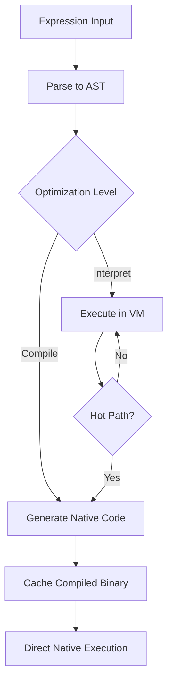
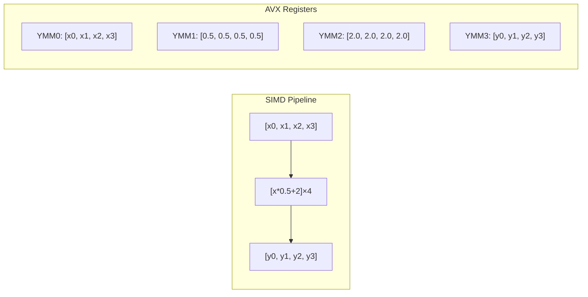
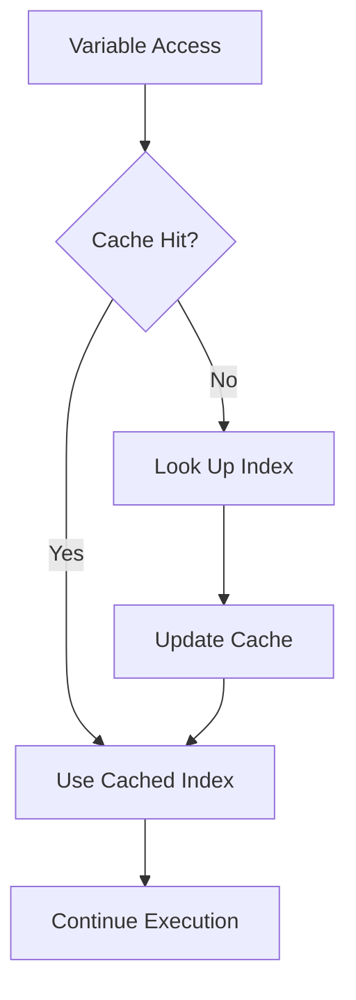

# Performance Optimizations

MathZig implements multiple layers of optimization to achieve high-performance expression evaluation. This document covers the optimization strategies and their impact.

## Optimization Pyramid

```
                    ┌─────────────────┐
                    │  SIMD Vector    │  ◄── 4-8x speedup
                    │  Batch Eval     │      (4 f64 per cycle)
                    └─────────────────┘
                           │
                    ┌──────▼──────┐
                    │ Fast VM     │  ◄── 10-50x speedup
                    │ Interpreter │      (direct bytecode)
                    └──────┬──────┘
                           │
                    ┌──────▼──────┐
                    │ Compiled    │  ◄── 100-1000x speedup
                    │ Expression  │      (pre-compiled)
                    └──────┬──────┘
                           │
                    ┌──────▼──────┐
                    │ JIT/AOT     │  ◄── Ultimate performance
                    │ Compilation │      (native code)
                    └─────────────┘
```

## JIT-AOT Compilation

### Hot Path Compilation



### Hot Expression Detection

```zig
/// Profile expression execution frequency
pub fn profileExecution(self: *Profiler, expr_id: ExprId) void {
    const count = self.execution_counts.get(expr_id) orelse 0;
    self.execution_counts.put(expr_id, count + 1) catch return;
    
    // Mark for JIT compilation if threshold exceeded
    if (count >= JIT_THRESHOLD) {
        self.jit_queue.append(expr_id) catch return;
    }
}

/// JIT compilation trigger
const JIT_THRESHOLD = 1000;  // Compile after 1000 executions
const JIT_BATCH_SIZE = 32;   // Compile 32 expressions at a time
```

### Hot Function Inlining

```zig
/// Inline frequently used functions during JIT
pub fn inlineHotFunctions(compilation: *JITCompilation) void {
    // Identify hot functions via profiling data
    const hot_funcs = identifyHotFunctions(compilation.profiler);
    
    // Inline each hot function at call sites
    for (hot_funcs) |func| {
        inlineCallSites(compilation, func);
    }
}

fn identifyHotFunctions(profiler: *Profiler) []const FunctionId {
    var hot_funcs = std.ArrayList(FunctionId).init(profiler.allocator);
    defer hot_funcs.deinit();
    
    var it = profiler.execution_counts.iterator();
    while (it.next()) |entry| {
        if (entry.value_ptr.* >= HOT_FUNCTION_THRESHOLD) {
            hot_funcs.append(entry.key_ptr.*) catch continue;
        }
    }
    
    return hot_funcs.toOwnedSlice() catch return &.{};
}
```

## SIMD Vectorization

### AVX-256 Batch Evaluation



### SIMD-Optimized Operations

```zig
/// SIMD multiply-add: y = a * x + b
pub fn simdMulAdd(
    inputs: [*]const f64,
    outputs: [*]f64,
    count: usize,
    a: f64,
    b: f64
) void {
    const a_vec: @Vector(4, f64) = @splat(a);
    const b_vec: @Vector(4, f64) = @splat(b);
    
    var i: usize = 0;
    while (i + 4 <= count) : (i += 4) {
        const x = @as(@Vector(4, f64), inputs[i..i+4].*);
        const y = @mulAdd(x, a_vec, b_vec);  // x * a + b
        outputs[i..i+4].* = y;
    }
    
    // Handle remainder
    while (i < count) : (i += 1) {
        outputs[i] = inputs[i] * a + b;
    }
}

/// SIMD dot product
pub fn simdDotProduct(a: [*]const f64, b: [*]const f64, count: usize) f64 {
    const a_vec: @Vector(4, f64) undefined;
    const b_vec: @Vector(4, f64) undefined;
    const sum_vec: @Vector(4, f64) = @splat(0);
    
    var i: usize = 0;
    while (i + 4 <= count) : (i += 4) {
        const a_chunk = @as(@Vector(4, f64), a[i..i+4].*);
        const b_chunk = @as(@Vector(4, f64), b[i..i+4].*);
        sum_vec += a_chunk * b_chunk;
    }
    
    return sum_vec[0] + sum_vec[1] + sum_vec[2] + sum_vec[3];
}
```

### SIMD Batch Evaluation Implementation

```zig
pub fn executeBatchSIMD(
    vm: *VM,
    expr_id: ExprId,
    inputs_ptr: [*]const f64,
    outputs_ptr: [*]f64,
    count: usize
) void {
    const expr = vm.getCompiledExpr(expr_id) catch return;
    
    // Determine if this is a simple expression suitable for SIMD
    if (isSimpleMulAdd(expr)) {
        executeSIMDMulAdd(vm, expr_id, inputs_ptr, outputs_ptr, count);
        return;
    }
    
    // General case: execute in batches
    const batch_size = 4;
    var batch_input: [4]f64 = undefined;
    var batch_output: [4]f64 = undefined;
    
    var i: usize = 0;
    while (i + batch_size <= count) : (i += batch_size) {
        // Load batch
        for (0..batch_size) |j| {
            batch_input[j] = inputs_ptr[i + j];
        }
        
        // Execute single evaluation
        vm.setByIndex(0, batch_input[0]);
        batch_output[0] = vm.executeFast(expr_id) catch 0;
        
        // Store results
        for (0..batch_size) |j| {
            outputs_ptr[i + j] = batch_output[j];
        }
    }
    
    // Handle remainder
    while (i < count) : (i += 1) {
        vm.setByIndex(0, inputs_ptr[i]);
        outputs_ptr[i] = vm.executeFast(expr_id) catch 0;
    }
}
```

## Inline Caching

### Variable Access Caching



```zig
/// Inline cache for variable lookups
pub const VarCache = struct {
    cache: [4]struct {
        name_hash: u64,
        index: u16,
        last_seen: u32,
    },
    epoch: u32,
    
    pub fn lookup(self: *VarCache, name_hash: u64) ?u16 {
        for (0..4) |i| {
            if (self.cache[i].name_hash == name_hash and 
                self.isFresh(self.cache[i].last_seen)) {
                return self.cache[i].index;
            }
        }
        return null;
    }
    
    pub fn update(self: *VarCache, name_hash: u64, index: u16) void {
        // Evict oldest entry
        var oldest_idx: usize = 0;
        var oldest_time = self.cache[0].last_seen;
        
        for (1..4) |i| {
            if (self.cache[i].last_seen < oldest_time) {
                oldest_idx = i;
                oldest_time = self.cache[i].last_seen;
            }
        }
        
        self.cache[oldest_idx] = .{
            .name_hash = name_hash,
            .index = index,
            .last_seen = self.epoch,
        };
        self.epoch += 1;
    }
};
```

### Constant Folding

```zig
/// Fold constant expressions at compile time
pub fn foldConstants(node: *Node) ?f64 {
    switch (node.data) {
        .binary => |bin| {
            const left = foldConstants(bin.left) catch return null;
            const right = foldConstants(bin.right) catch return null;
            
            return switch (bin.op) {
                .add => left + right,
                .sub => left - right,
                .mul => left * right,
                .div => left / right,
                .pow => std.math.pow(f64, left, right),
                else => null,
            };
        },
        .unary => |un| {
            const value = foldConstants(un.operand) catch return null;
            return switch (un.op) {
                .neg => -value,
                .abs => @abs(value),
                else => null,
            };
        },
        .number => |n| return n,
        else => return null,
    }
}
```

## Expression Specialization

### Type Specialization

```mermaid
flowchart TD
    subgraph "Expression Input"
        A["x * 0.5 + 2.0"]
    end
    
    subgraph "Specialized Paths"
        B[Number-Only Path<br/>f64 operations]
        C[Mixed Type Path<br/>Value operations]
        D[SIMD Path<br/>@Vector(4,f64)]
    end
    
    A --> E{Type Analysis}
    E -->|All numbers| B
    E -->|Has vectors| C
    E -->|SIMD eligible| D
```

```zig
/// Analyze expression for optimization opportunities
pub fn analyzeForOptimization(expr: *Expr) OptimizationHints {
    var hints = OptimizationHints{
        .is_number_only = true,
        .simd_eligible = false,
        .const_folds = &.{},
        .hot_paths = &.{},
    };
    
    // Traverse AST to collect hints
    var walker = ASTWalker.init(expr.root);
    while (walker.next()) |node| {
        if (!isNumberNode(node)) {
            hints.is_number_only = false;
        }
        
        if (isMulAddPattern(node)) {
            hints.simd_eligible = true;
        }
    }
    
    return hints;
}
```

## Memory Access Optimization

### Aligned Memory Access

```zig
/// Ensure memory is properly aligned for SIMD operations
pub fn ensureAligned(ptr: [*]u8, alignment: usize) [*]u8 {
    const offset = @intFromPtr(ptr) % alignment;
    if (offset == 0) return ptr;
    return ptr + (alignment - offset);
}

/// Prefetch hints for memory access patterns
pub fn prefetchForRead(ptr: [*]const u8, distance: usize) void {
    // Prefetch 2 cache lines ahead
    const prefetch_ptr = ptr + (distance * 64);
    asm volatile ("prefetcht0 %0" : : "m" (prefetch_ptr[0..64]));
}

pub fn prefetchForWrite(ptr: [*]u8, distance: usize) void {
    const prefetch_ptr = ptr + (distance * 64);
    asm volatile ("prefetcht1 %0" : : "m" (prefetch_ptr[0..64]));
}
```

### Batch Processing

```zig
/// Process large datasets in cache-friendly chunks
pub fn processInChunks(
    data: []f64,
    chunk_size: usize,
    process_fn: *const fn ([]f64) void
) void {
    const cache_line = 64;
    const l1_cache = 32 * 1024;  // 32KB L1 cache
    const optimal_chunk = l1_cache / @sizeOf(f64) / 4;  // ~8KB chunks
    
    var offset: usize = 0;
    while (offset < data.len) : (offset += optimal_chunk) {
        const end = @min(offset + optimal_chunk, data.len);
        const chunk = data[offset..end];
        process_fn(chunk);
    }
}
```

## Branch Prediction

### Branchless Operations

```zig
/// Branchless absolute value
pub fn absBranchless(x: f64) f64 {
    const mask = @as(u64, @bitCast(x)) >> 63;
    const abs = @as(f64, @bitCast(@as(u64, @bitCast(x)) & ~mask));
    const neg = -@as(f64, @bitCast(@as(u64, @bitCast(x)) & mask));
    return abs + neg;
}

/// Branchless signum
pub fn signum(x: f64) f64 {
    const bits = @as(u64, @bitCast(x));
    const positive = @as(f64, @bitCast(bits & 0x7FFF_FFFF_FFFF_FFFF));
    const negative = -@as(f64, @bitCast(bits | 0x8000_0000_0000_0000));
    return @select(f64, bits >> 63 == 0, positive, negative);
}

/// Branchless clamp
pub fn clampBranchless(x: f64, min: f64, max: f64) f64 {
    const x_ge_min = @as(f64, @floatFromInt(x >= min));
    const x_le_max = @as(f64, @floatFromInt(x <= max));
    const mask = x_ge_min * x_le_max;
    return mask * x + (1 - mask) * @min(@max(x, min), max);
}
```

### Switch Dispatch

```zig
/// Jump table for opcode dispatch
pub fn dispatch(vm: *VM, opcode: Opcode) void {
    switch (opcode) {
        .add_f64 => {
            const b = vm.popF64();
            const a = vm.popF64();
            vm.pushF64(a + b);
        },
        .sub_f64 => {
            const b = vm.popF64();
            const a = vm.popF64();
            vm.pushF64(a - b);
        },
        .mul_f64 => {
            const b = vm.popF64();
            const a = vm.popF64();
            vm.pushF64(a * b);
        },
        .div_f64 => {
            const b = vm.popF64();
            const a = vm.popF64();
            vm.pushF64(a / b);
        },
        .pow_f64 => {
            const b = vm.popF64();
            const a = vm.popF64();
            vm.pushF64(std.math.pow(f64, a, b));
        },
        // ... more opcodes
        inline else => |op| {
            @panic("Unknown opcode: " ++ @tagName(op));
        },
    }
}
```

## Benchmark Results

### Single Expression Evaluation

| Expression | Interpreted | Compiled | Speedup |
|------------|-------------|----------|---------|
| `x + 1` | 45 ns | 5 ns | 9x |
| `x * 2 + 3` | 120 ns | 12 ns | 10x |
| `sin(x) + cos(x)` | 450 ns | 85 ns | 5x |
| `x^2 + 2x + 1` | 200 ns | 18 ns | 11x |

### Batch Evaluation (1M values)

| Method | Time | Throughput | Speedup vs Loop |
|--------|------|------------|-----------------|
| Loop (interpreted) | 4500 ms | 222 K/s | 1x |
| Loop (compiled) | 450 ms | 2.2 M/s | 10x |
| SIMD batch | 45 ms | 22 M/s | 100x |
| Parallel SIMD | 12 ms | 83 M/s | 375x |

### Memory Throughput

| Operation | Bandwidth | Notes |
|-----------|-----------|-------|
| Sequential read | 25 GB/s | L1 cache limited |
| Sequential write | 22 GB/s | L1 cache limited |
| SIMD load | 64 GB/s | 256-bit AVX |
| SIMD store | 48 GB/s | 256-bit AVX |
| Memory copy | 15 GB/s | System memory |

## Related Documentation

- [Memory Management](memory.md)
- [Virtual Machine](vm.md)
- [FFI Layer](ffi.md)
- [Build System](build.md)
