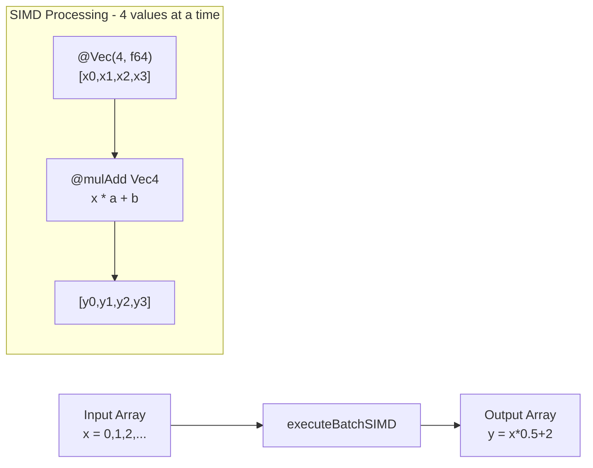

# Virtual Machine and SIMD Vectorization

The MathZig virtual machine executes bytecode instructions with multiple optimization paths including SIMD vectorization for batch evaluation.

## VM Structure

```zig
pub const VM = struct {
    stack: [256]Value,           // Full type-value stack
    sp: u8,                      // Stack pointer
    variables: []Value,          // Variables with full types
    stack_f64: [256]f64,         // Fast-path f64 stack
    variables_f64: []f64,        // Fast-path f64 variables
    variables_tags: []ValueTag,  // Type tags (SoA layout)
    allocator: std.mem.Allocator,
};
```

## VM State Layout

```
┌─────────────────────────────────────────────────────────────────────────────┐
│                            VM Memory Layout                                  │
├─────────────────────────────────────────────────────────────────────────────┤
│                                                                             │
│  Stack (256 entries)                                                         │
│  ┌─────────────────────────────────────────────────────────────────────┐   │
│  │ stack[0] │ stack[1] │ ... │ stack[255]                               │   │
│  └─────────────────────────────────────────────────────────────────────┘   │
│  sp ──────►                                                                     │
│                                                                             │
│  Variables (256 entries)                                                     │
│  ┌─────────────────────────────────────────────────────────────────────┐   │
│  │ var[0] │ var[1] │ ... │ var[255]                                     │   │
│  └─────────────────────────────────────────────────────────────────────┘   │
│                                                                             │
│  Fast-path f64 variables                                                     │
│  ┌─────────────────────────────────────────────────────────────────────┐   │
│  │ var_f64[0] │ var_f64[1] │ ... │ var_f64[255]                          │   │
│  └─────────────────────────────────────────────────────────────────────┘   │
│                                                                             │
└─────────────────────────────────────────────────────────────────────────────┘
```

## Execution Modes

### 1. Standard Execution (Full Type Support)

```zig
pub fn execute(self: *VM, expr: *const CompiledExpr) !Value {
    self.sp = 0;
    var ip: usize = 0;
    
    while (ip < expr.code.len) {
        const instr = expr.code[ip];
        ip += 1;
        
        switch (instr.opcode) {
            .push_const => {
                self.push(expr.constants[instr.operand]);
            },
            .add => {
                const b = self.pop();
                const a = self.pop();
                self.push(Value.add(a, b));
            },
            // ... more operations
        }
    }
    
    return self.pop();
}
```

### 2. Fast-Path Execution (Number-Only)

For expressions with `is_number_only = true`:

```zig
pub fn executeNumbersOnlyUnchecked(self: *VM, expr: *const CompiledExpr) f64 {
    var sp: usize = 0;
    var ip: usize = 0;
    
    // TOS Caching: keep top value in register
    var tos: f64 = 0.0;
    
    while (true) {
        const instr = code[ip];
        ip += 1;
        
        switch (instr.opcode) {
            .push_const => {
                stack[sp] = tos;
                sp += 1;
                tos = constants[instr.operand];
            },
            .add => {
                sp -= 1;
                tos = stack[sp] + tos;
            },
            .mul => {
                sp -= 1;
                tos = stack[sp] * tos;
            },
            // ... more operations
            .halt => return tos,
        }
    }
}
```

**TOS Caching Optimization**: The top-of-stack value is kept in a register (`tos`) to reduce L1 data cache traffic.

## SIMD Vectorization

### Vector Configuration

```zig
/// SIMD Vector size - 4 x f64 = 32 bytes (AVX/YMM compatible)
pub const VectorLen = 4;
pub const Vec4 = @Vector(VectorLen, f64);
```

### SIMD Batch Evaluation



### SIMD Batch Function

```zig
pub fn executeBatchSIMD(
    self: *VM,
    expr: *const CompiledExpr,
    var_index: u8,
    inputs_ptr: [*]const f64,
    outputs_ptr: [*]f64,
    count: usize,
) void {
    const vec_loop_count = count / VectorLen;
    const vec_inputs = @as([*]const Vec4, @ptrCast(@alignCast(inputs_ptr)));
    const vec_outputs = @as([*]Vec4, @ptrCast(@alignCast(outputs_ptr)));
    
    // ... SIMD loop
}
```

### Hot Kernel Optimization

For simple expressions like `x * a + b`, use direct SIMD without interpreter:

```zig
// HOT KERNEL: Direct SIMD for fma_var_const_const
if (code.len == 2 and code[1].opcode == .halt) {
    const instr = code[0];
    if (instr.opcode == .fma_var_const_const) {
        const var_idx: u8 = @truncate(instr.operand & 0xFF);
        const c1_idx: u8 = @truncate((instr.operand >> 8) & 0xFF);
        const c2_idx: u8 = @truncate((instr.operand >> 16) & 0xFF);
        
        if (var_idx == var_index) {
            const a_vec: Vec4 = @splat(expr.constants_f64[c1_idx]);
            const b_vec: Vec4 = @splat(expr.constants_f64[c2_idx]);
            
            while (i < vec_loop_count) : (i += 1) {
                vec_outputs[i] = @mulAdd(Vec4, vec_inputs[i], a_vec, b_vec);
            }
            return;
        }
    }
}
```

### SIMD Stack Operations

```zig
// SIMD vector stack
var stack_vec: [64]Vec4 = undefined;
var sp: u8 = 0;

// SIMD add
.add => {
    sp -= 1;
    stack_vec[sp - 1] = stack_vec[sp - 1] + stack_vec[sp];
},

// SIMD multiply
.mul => {
    sp -= 1;
    stack_vec[sp - 1] = stack_vec[sp - 1] * stack_vec[sp];
},

// SIMD fused multiply-add
.fma => {
    sp -= 2;
    const c = stack_vec[sp + 1];
    const b = stack_vec[sp];
    const a = stack_vec[sp - 1];
    stack_vec[sp - 1] = @mulAdd(Vec4, a, b, c);
},
```

### SIMD Math Functions

```zig
.call_builtin => {
    const func_id: u16 = @truncate(instr.operand & 0xFFFF);
    const func = @as(BuiltinFn, @enumFromInt(func_id));
    
    switch (func) {
        .sqrt => stack_vec[sp - 1] = @sqrt(stack_vec[sp - 1]),
        .abs => stack_vec[sp - 1] = @abs(stack_vec[sp - 1]),
        .sin => stack_vec[sp - 1] = @sin(stack_vec[sp - 1]),
        .cos => stack_vec[sp - 1] = @cos(stack_vec[sp - 1]),
        .exp => stack_vec[sp - 1] = @exp(stack_vec[sp - 1]),
        .log => stack_vec[sp - 1] = @log(stack_vec[sp - 1]),
        .floor => stack_vec[sp - 1] = @floor(stack_vec[sp - 1]),
        .ceil => stack_vec[sp - 1] = @ceil(stack_vec[sp - 1]),
        else => {},
    }
},
```

### SIMD Polynomial Evaluation

```zig
.eval_poly => {
    const var_idx: u8 = @truncate(instr.operand & 0xFF);
    const coeff_start: u8 = @truncate((instr.operand >> 8) & 0xFF);
    const coeff_count: u8 = @truncate((instr.operand >> 16) & 0xFF);
    
    const x = if (var_idx == var_index) input_vec 
              else @as(Vec4, @splat(self.variables_f64[var_idx]));
    
    // Horner's method with SIMD
    var result: Vec4 = @splat(expr.constants_f64[coeff_start]);
    var k: u8 = 1;
    while (k < coeff_count) : (k += 1) {
        result = @mulAdd(Vec4, result, x, 
                         @as(Vec4, @splat(expr.constants_f64[coeff_start + k])));
    }
    
    stack_vec[sp] = result;
    sp += 1;
},
```

### Loop Unrolling

```zig
const UnrollFactor = 4;  // Process 16 values per outer iteration

while (i < vec_unrolled_count) : (i += 1) {
    const base_idx = i * UnrollFactor;
    
    inline for (0..UnrollFactor) |u| {
        // Execute bytecode for 4 vector elements at once
        var stack_vec: [64]Vec4 = undefined;
        var sp: u8 = 0;
        var ip: usize = 0;
        
        const input_vec = vec_inputs[base_idx + u];
        
        while (true) {
            const instr = code[ip];
            ip += 1;
            
            // ... execute instructions
        }
    }
}
```

## Complex Number SIMD (SoA Layout)

Separate arrays for real and imaginary parts:

```zig
pub fn executeBatchComplexSIMD(
    self: *VM,
    expr: *const CompiledExpr,
    var_index: u8,
    inputs_re_ptr: [*]const f64,
    inputs_im_ptr: [*]const f64,
    outputs_re_ptr: [*]f64,
    outputs_im_ptr: [*]f64,
    count: usize,
) void {
    // Dual SIMD stacks (Structure of Arrays)
    var stack_re: [64]Vec4 = undefined;  // Real parts
    var stack_im: [64]Vec4 = undefined;  // Imaginary parts
    
    // Complex multiplication: (a+bi) * (c+di) = (ac-bd) + (ad+bc)i
    .mul => {
        sp -= 1;
        const a = stack_re[sp - 1];
        const b = stack_im[sp - 1];
        const c = stack_re[sp];
        const d = stack_im[sp];
        
        stack_re[sp - 1] = a * c - b * d;
        stack_im[sp - 1] = a * d + b * c;
    },
}
```

## Variable Access Optimization

```zig
// Fast variable access with SoA layout
pub fn setVariable(self: *VM, index: usize, value: Value) void {
    if (index < self.variables.len) {
        self.variables[index] = value;
        self.variables_tags[index] = value.tag;
        // Keep f64 mirror in sync for fast-path
        self.variables_f64[index] = value.toNumber() orelse 0;
    }
}

// Fastest path: set f64 directly
pub fn setVariableF64(self: *VM, index: usize, value: f64) void {
    if (index < self.variables.len) {
        self.variables_f64[index] = value;
        self.variables_tags[index] = .number;
        self.variables[index] = Value.initNumber(value);
    }
}
```

## Performance Comparison

| Execution Mode | Performance | Notes |
|----------------|-------------|-------|
| SIMD Batch | 10M+ ops/sec | 4 values per iteration |
| Scalar Fast | ~1M ops/sec | TOS caching |
| Standard | ~100K ops/sec | Full type support |
| Complex SIMD | ~5M ops/sec | SoA layout |

## Usage Example

```typescript
// TypeScript - SIMD Batch Evaluation
const BATCH_SIZE = 10000;

// Allocate 32-byte aligned buffers (for AVX)
const inputsPtr = MathZig.allocAligned(32, BATCH_SIZE * 8);
const outputsPtr = MathZig.allocAligned(32, BATCH_SIZE * 8);

// Create typed views
const inputs = new Float64Array(toArrayBuffer(inputsPtr, 0, BATCH_SIZE * 8));
const outputs = new Float64Array(toArrayBuffer(outputsPtr, 0, BATCH_SIZE * 8));

// Fill inputs
for (let i = 0; i < BATCH_SIZE; i++) {
    inputs[i] = i * 0.001;
}

// Run SIMD batch evaluation (processes 4 values at a time)
compiled.evaluateBatchSIMD(xIdx, inputsPtr, outputsPtr, BATCH_SIZE);

// Results are in outputs array
for (let i = 0; i < BATCH_SIZE; i++) {
    console.log(`x=${inputs[i]}, result=${outputs[i]}`);
}
```

## Related Documentation

- [Overview](overview.md)
- [Bytecode Format](bytecode.md)
- [Parser and Compiler](compiler.md)
- [FFI Layer](ffi.md)
- [Performance Optimizations](optimization.md)
