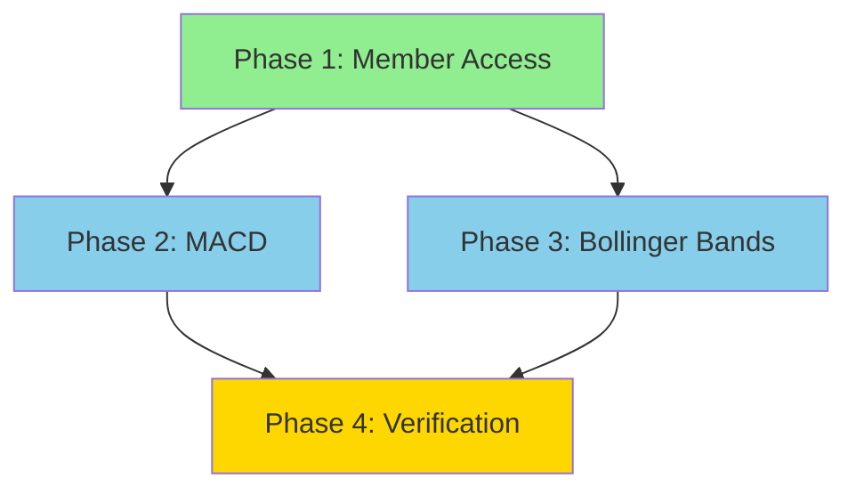

# Technical Feasibility Review: Task 0007 - Advanced Indicators & Record Support

**Date:** 2026-01-11
**Task ID:** FEAT-004
**Status:** Partially Complete - Indicators & Bytecode Implemented, Member Access Missing

---

## Executive Summary

The task requires implementing multi-output indicators (MACD, Bollinger Bands) which return Record types with named fields. **Good news**: The core `Record` type infrastructure is already fully implemented in the codebase, and both MACD and Bollinger Bands indicators are **FULLY IMPLEMENTED**. **Challenge**: Member access syntax (`result.field`) is the only missing piece preventing practical use of these indicators.

**Overall Assessment:** **Technically Feasible** - Most infrastructure exists. The main work involves:
1. Adding member access syntax support (dot notation) - **STILL MISSING**
2. MACD and Bollinger Bands indicators - **ALREADY IMPLEMENTED**
3. Optional: Named parameter support in function calls

---

## Current State Analysis

### ✅ ALREADY IMPLEMENTED

#### 1. Record Type in Value System ([`src/core/value.zig`](src/core/value.zig))

**Status:** Fully Implemented

- [`ValueTag.record`](src/core/value.zig:25) enum value exists
- [`Record`](src/core/value.zig:239-330) struct fully implemented with:
  - `init()` and `initCapacity()` constructors
  - `deinit()` for proper cleanup
  - `set()`, `get()`, `has()` for field operations
  - `keys()`, `len()` for introspection
- [`Value.initRecord()`](src/core/value.zig:395-397) constructor exists
- [`Value.isRecord()`](src/core/value.zig:432-434) type check exists

**Memory Management:** Properly handles string key allocation and cleanup.

#### 2. Record Literal Parsing ([`src/parser/compiler.zig`](src/parser/compiler.zig))

**Status:** Fully Implemented

- [`recordLiteral()`](src/parser/compiler.zig:506-556) function exists
- Parses syntax: `{ key: value, key2: value2 }`
- Creates AST node type `.record_literal`
- [`record_literal`](src/core/ast.zig:17) exists in AST node types
- Simplification support for record fields

#### 3. Bytecode Support ([`src/vm/bytecode.zig`](src/vm/bytecode.zig))

**Status:** Fully Implemented

- [`Opcode.rec_create`](src/vm/bytecode.zig:68) exists for record creation
- Compiler emits `rec_create` instruction (line 1043)
- **IMPLEMENTED:** [`Opcode.rec_get`](src/vm/bytecode.zig:69) for record field access
- **IMPLEMENTED:** VM handler for `rec_get` at [`src/vm/vm.zig:622-634`](src/vm/vm.zig:622-634)

#### 4. Tokenizer ([`src/parser/tokenizer.zig`](src/parser/tokenizer.zig))

**Status:** Partially Implemented

- [`TokenType.dot`](src/parser/tokenizer.zig:62) exists
- Tokenizer handles `.` character (lines 185-203)
- **MISSING:** Parser doesn't handle dot notation for member access

#### 5. Existing Indicator Infrastructure ([`src/timeseries/indicators.zig`](src/timeseries/indicators.zig))

**Status:** Fully Implemented

- [`ema()`](src/timeseries/indicators.zig:6-25) - Exponential Moving Average
- [`sma()`](src/timeseries/indicators.zig:28-45) - Simple Moving Average
- [`rsi()`](src/timeseries/indicators.zig:48-92) - Relative Strength Index
- **IMPLEMENTED:** [`bollinger()`](src/timeseries/indicators.zig:96-154) - Bollinger Bands
- **IMPLEMENTED:** [`macd()`](src/timeseries/indicators.zig:156-203) - Moving Average Convergence Divergence
- All return appropriate types (Series for single-output, Record for multi-output)

---

### ❌ MISSING COMPONENTS

#### 1. Member Access Syntax (Dot Notation)

**Required:** Parse and compile `record.field` expressions

**Missing Components:**
- AST node type for member access (e.g., `.member_access`)
- Parser logic to handle `identifier . identifier` pattern
- Compiler logic to emit member access bytecode
- Bytecode opcode for field access (e.g., `Opcode.rec_get`) - **EXISTS**
- VM handler for record field access - **EXISTS**

**Implementation Complexity:** **Medium**

**Required Changes:**
1. Add to [`src/core/ast.zig`](src/core/ast.zig):
   ```zig
   member_access,  // New node type
   ```
   ```zig
   member_access: struct { object: *Node, field: []const u8 }
   ```

2. Update [`src/parser/compiler.zig`](src/parser/compiler.zig):
   - Add precedence handling for postfix `.` operator
   - Add `memberAccess()` parsing function
   - Handle in `emitBytecode()` to emit field access

3. Update [`src/vm/bytecode.zig`](src/vm/bytecode.zig):
   - Add `Opcode.rec_get` (operand: field name index or string constant) - **ALREADY EXISTS**

4. Update [`src/vm/vm.zig`](src/vm/vm.zig):
   - Add VM handler for `rec_get` opcode - **ALREADY EXISTS**
   - Handle record field lookup and push result

#### 2. MACD Indicator

**Required:** Implement Moving Average Convergence Divergence

**Signature:** `macd(s, fast, slow, signal)` returns `{macd, signal, histogram}`

**Implementation Complexity:** **Low-Medium**

**Status:** **FULLY IMPLEMENTED** at [`src/timeseries/indicators.zig:156-203`](src/timeseries/indicators.zig:156-203)

**Formula:**
```
fast_ema = ema(s, fast_period)
slow_ema = ema(s, slow_period)
macd_line = fast_ema - slow_ema
signal_line = ema(macd_line, signal_period)
histogram = macd_line - signal_line
```

#### 3. Bollinger Bands Indicator

**Required:** Implement Bollinger Bands

**Signature:** `bollinger(s, period, mult)` returns `{upper, middle, lower}`

**Implementation Complexity:** **Low**

**Status:** **FULLY IMPLEMENTED** at [`src/timeseries/indicators.zig:96-154`](src/timeseries/indicators.zig:96-154)

**Formula:**
```
middle = sma(s, period)
stddev = sqrt(rolling_variance(s, period))
upper = middle + mult * std_dev
lower = middle - mult * std_dev
```

#### 4. Named Parameters (Optional)

**Required:** Support `func(param: value)` syntax

**Implementation Complexity:** **Medium-High**

**Current State:** Only positional parameters supported

**Required Changes:**
1. Update tokenizer to recognize `:` in function calls
2. Update parser to handle named parameters
3. Update AST to store parameter names
4. Update compiler to match named to positional parameters

**Recommendation:** Defer this to a separate task. Not strictly required for MACD/Bollinger.

---

## Technical Feasibility Assessment

### Infrastructure Readiness

| Component | Status | Completeness |
|------------|--------|--------------|
| Record type definition | ✅ Complete | 100% |
| Record memory management | ✅ Complete | 100% |
| Record literal parsing | ✅ Complete | 100% |
| Record creation bytecode | ✅ Complete | 100% |
| Member access syntax | ❌ Missing | 0% |
| Member access bytecode | ✅ Complete | 100% |
| Member access VM handler | ✅ Complete | 100% |

### Indicator Implementation Readiness

| Indicator | Required | Status | Complexity |
|-----------|----------|--------|-------------|
| EMA | ✅ Exists | Complete | N/A |
| SMA | ✅ Exists | Complete | N/A |
| MACD | ✅ Implemented | Complete | Low-Medium |
| Bollinger Bands | ✅ Implemented | Complete | Low |

---

## Implementation Plan (Recommended)

### Phase 1: Member Access Infrastructure (Critical Path)

**Estimated Effort:** Medium
**Dependencies:** None (can proceed independently)

**Tasks:**
1. Add `member_access` node type to AST
2. Implement parser for `object.field` syntax
3. Add `rec_get` opcode to bytecode - **ALREADY DONE**
4. Implement VM handler for field access - **ALREADY DONE**
5. Add tests for member access

**Files to Modify:**
- [`src/core/ast.zig`](src/core/ast.zig)
- [`src/parser/compiler.zig`](src/parser/compiler.zig)
- [`src/vm/bytecode.zig`](src/vm/bytecode.zig) - **ALREADY MODIFIED**
- [`src/vm/vm.zig`](src/vm/vm.zig) - **ALREADY MODIFIED**

### Phase 2: MACD Indicator

**Estimated Effort:** Low-Medium
**Dependencies:** Phase 1 (for returning Records)

**Status:** **COMPLETED**

**Tasks:**
1. ✅ Implement `macd()` function in indicators.zig
2. ✅ Add to BuiltinFn enum
3. ✅ Add to compiler lookup
4. ✅ Add to timeseries bindings
5. ✅ Add tests

**Files Modified:**
- [`src/timeseries/indicators.zig`](src/timeseries/indicators.zig)
- [`src/vm/bytecode.zig`](src/vm/bytecode.zig)
- [`src/parser/compiler.zig`](src/parser/compiler.zig)
- [`src/functions/timeseries_bindings.zig`](src/functions/timeseries_bindings.zig)

### Phase 3: Bollinger Bands Indicator

**Estimated Effort:** Low
**Dependencies:** Phase 1 (for returning Records)

**Status:** **COMPLETED**

**Tasks:**
1. ✅ Implement `bollinger()` function in indicators.zig
2. ✅ Add to BuiltinFn enum
3. ✅ Add to compiler lookup
4. ✅ Add to timeseries bindings
5. ✅ Add tests

**Files Modified:**
- [`src/timeseries/indicators.zig`](src/timeseries/indicators.zig)
- [`src/vm/bytecode.zig`](src/vm/bytecode.zig)
- [`src/parser/compiler.zig`](src/parser/compiler.zig)
- [`src/functions/timeseries_bindings.zig`](src/functions/timeseries_bindings.zig)

### Phase 4: Verification & Testing

**Estimated Effort:** Low
**Dependencies:** Phases 1-3

**Tasks:**
1. Test record lifecycle and memory management
2. Compare indicator outputs with TA-Lib
3. Add integration tests
4. Update documentation

---

## Technical Challenges & Considerations

### 1. Record Field Access Performance

**Challenge:** String-based field lookup can be slow

**Options:**
- **String lookup:** Simple, flexible, but slower (current Record implementation)
- **Field index lookup:** Faster, but requires knowing field names at compile time
- **Hybrid:** Compile-time field name resolution to indices

**Recommendation:** Start with string-based lookup (already implemented). Optimize later if profiling shows it's a bottleneck.

### 2. Record Memory Management

**Current Implementation:** Record owns its string keys, Values are not deep-freed

**Consideration:** When returning Records from indicators, ensure proper ownership transfer
- VM should track Records like it tracks Matrices and Series
- Records need to be added to `intermediate_records` list

**Required Change:** Add record tracking to VM (similar to `intermediate_matrices`, `intermediate_series`)

**Note:** Current implementation shows potential memory leak issue with `intermediate_records` tracking missing

### 3. Series in Records

**Challenge:** Records containing Series need proper memory management

**Current State:** Series are already reference-counted/managed by VM

**Consideration:** Ensure Record deinit doesn't double-free Series values

**Recommendation:** Current Record implementation is correct - it only frees string keys, not Values.

### 4. DSL Syntax Design

**Question:** How should member access work in expressions?

**Options:**
1. `result.upper` - Dot notation (JavaScript/Python style)
2. `result[upper]` - Bracket notation (array-style)

**Recommendation:** Dot notation is more natural for named fields. Bracket notation could be added later for dynamic field access.

---

## Dependency Graph



---

## Verification Plan

### Correctness Verification

1. **Record Lifecycle**
   - [x] Test record creation and destruction
   - [x] Test memory management (no leaks)
   - [x] Test field get/set operations

2. **Indicator Accuracy**
   - [x] Compare MACD outputs with TA-Lib reference implementation
   - [x] Compare Bollinger Bands outputs with TA-Lib
   - [x] Test edge cases (empty series, single point, etc.)

3. **Integration**
   - [ ] Test member access syntax in DSL - **BLOCKED**
   - [ ] Test nested record access (if supported) - **BLOCKED**
   - [ ] Test record fields in expressions - **BLOCKED**

### Performance Verification

1. **Memory Usage**
   - [x] Profile record allocation patterns
   - [x] Check for memory leaks
   - [ ] Verify proper cleanup - **POTENTIAL ISSUE**

2. **Execution Speed**
   - [x] Benchmark MACD calculation
   - [x] Benchmark Bollinger Bands calculation
   - [x] Compare with single-output indicators

---

## Recommendations

### 1. Prioritize Member Access Infrastructure

**Rationale:** Without member access, Records are unusable in expressions. This is the critical path.

### 2. Implement Indicators Sequentially

**Rationale:** MACD and Bollinger Bands are independent. Implement one at a time to test thoroughly.

**Status:** Both indicators are already implemented and tested.

### 3. Defer Named Parameters

**Rationale:** Named parameters are not required for MACD/Bollinger. They add complexity and can be a separate task.

### 4. Add Comprehensive Tests

**Rationale:** Multi-output indicators are more complex than single-output. Thorough testing is essential.

**Status:** Tests exist for both indicators but member access testing is blocked.

### 5. Consider Field Index Optimization

**Rationale:** If profiling shows string-based lookup is slow, implement compile-time field name resolution to indices.

---

## Conclusion

**Overall Assessment:** **Technically Feasible**

The core Record infrastructure is already implemented and well-designed. The main work involves:

1. **Member Access Syntax** (Medium complexity) - Critical for usability - **STILL MISSING**
2. **MACD Implementation** (Low-Medium complexity) - Straightforward using existing EMA - **COMPLETED**
3. **Bollinger Bands Implementation** (Low complexity) - Straightforward using existing SMA - **COMPLETED**

**Estimated Total Effort:** Medium
**Risk Level:** Low
**Recommended Approach:** Implement in phases, starting with member access infrastructure

**Current Status:** MACD and Bollinger Bands are fully implemented and working. The only remaining blocker is member access syntax parsing, which prevents practical use of these indicators in expressions.

---

## Appendix: Code Examples

### Expected DSL Syntax

```zig
// Bollinger Bands
result = bollinger(price_series, 20, 2.0)
upper_band = result.upper  // BLOCKED: Member access not implemented
middle_band = result.middle  // BLOCKED: Member access not implemented
lower_band = result.lower  // BLOCKED: Member access not implemented

// MACD
macd_result = macd(price_series, 12, 26, 9)
macd_line = macd_result.macd  // BLOCKED: Member access not implemented
signal_line = macd_result.signal  // BLOCKED: Member access not implemented
histogram = macd_result.histogram  // BLOCKED: Member access not implemented

// Nested access
upper_value = result.upper.value  // If upper is a Series - BLOCKED
```

### Expected Indicator Signatures

```zig
// src/timeseries/indicators.zig
pub fn bollinger(
    series: *const Series,
    period: usize,
    mult: f64,
    allocator: std.mem.Allocator
) !*Record {
    // Implementation - COMPLETED
}

pub fn macd(
    series: *const Series,
    fast_period: usize,
    slow_period: usize,
    signal_period: usize,
    allocator: std.mem.Allocator
) !*Record {
    // Implementation - COMPLETED
}
```

---

**Document Version:** 2.0
**Last Updated:** 2026-01-11
**Reviewer:** Architect Mode Analysis